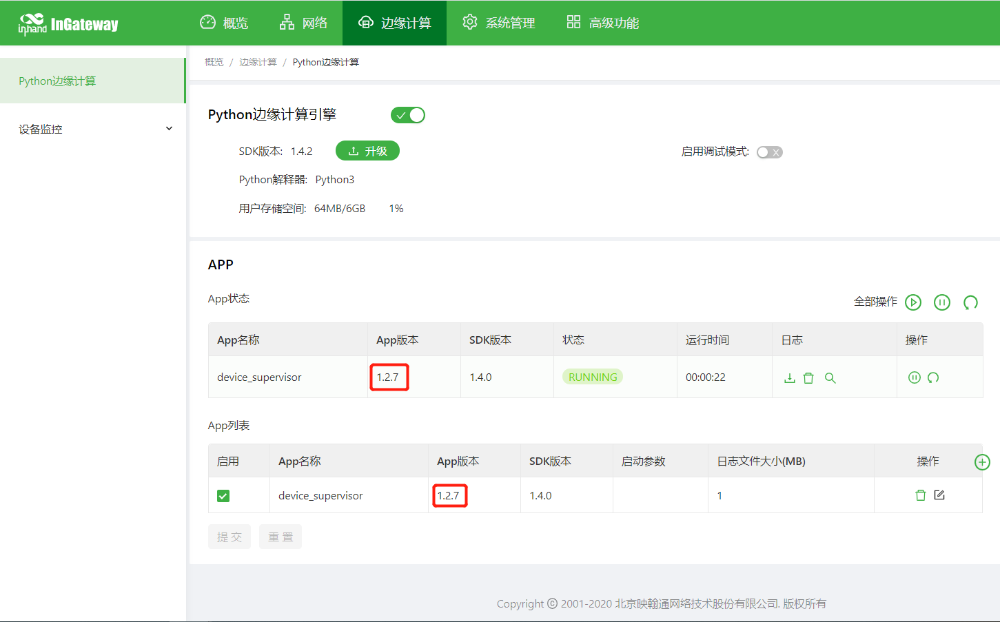
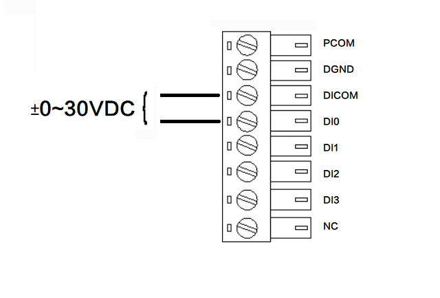
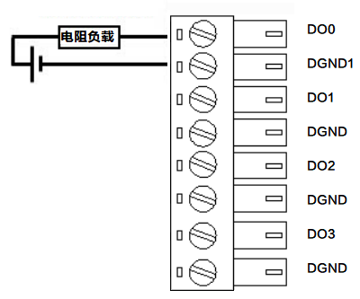
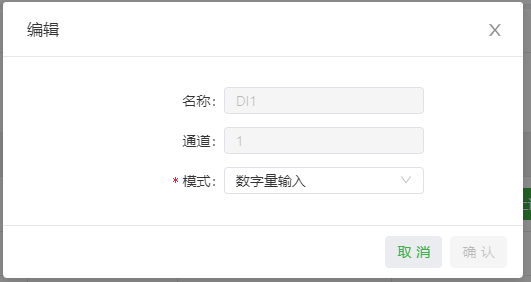
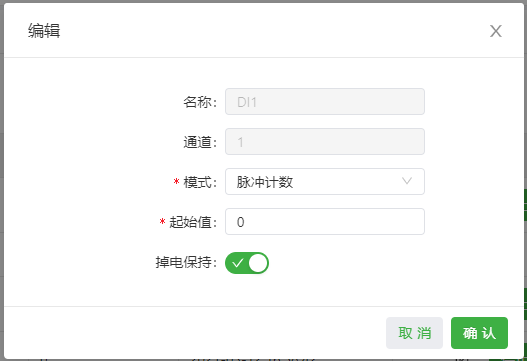
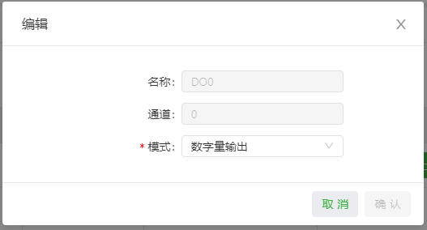
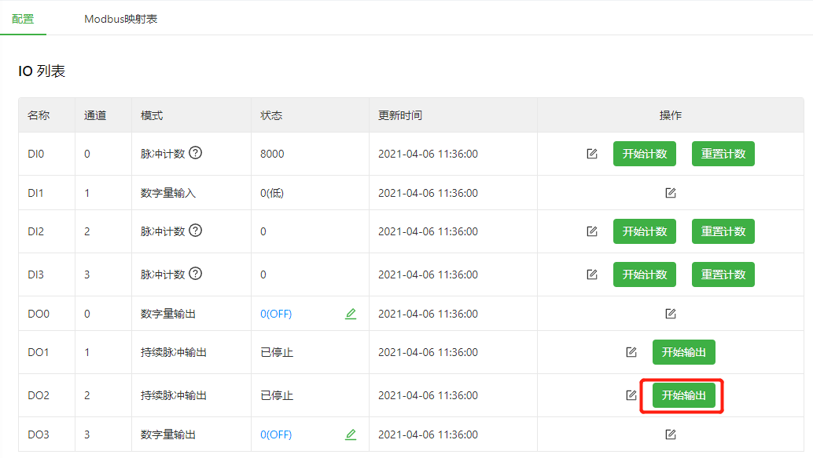
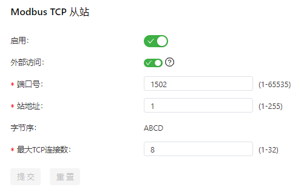
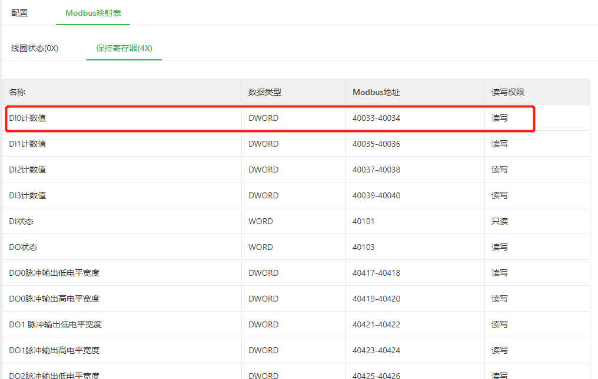
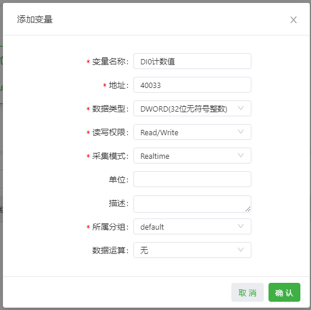

# InGateway502快速使用手册
本文档用于对InGateway502（以下简称IG502）联网、软件版本更新等基础配置操作进行说明，便于用户掌握IG502的基础配置和常用功能的使用方法。

  - [1. 配置IG502网络参数](#configure-ig502-network-parameters)
    - [1.1 访问IG502](#set-lan-parameters)
    - [1.2 IG502连接Internet](#set-wan-parameters)
  - [2. 更新软件版本](#update-the-software)
    - [2.1 更新IG502固件版本](#update-the-firmware-software)
    - [2.2 更新IG502 Python SDK版本](#update-the-sdk-software)
  - [3. Pyhon边缘计算](#use-python-edge-computing)
    - [3.1 安装和运行Python App](#install-and-run-python-app)
    - [3.2 更新Python App运行配置](#update-configuration-file-for-app)
    - [3.3 更新Python App版本](#update-python-app-version)
    - [3.4 开启调试模式](#enable-the-debug-mode)
  - [4. 设备云平台](#device-manager)
  - [5. 数据采集及数据上云](#device-supervisor)
  - [6.IO模块](#io-module)
  - [附录](#appendix)
    - [恢复出厂设置](#factory-reset)

  

## 1. 配置IG502网络参数

  

### 1.1 访问IG502
- 步骤1：IG502的WAN口的默认ip地址为192.168.1.1，LAN口的默认ip地址为192.168.2.1。本文档以通过LAN口访问IG502为例，设置PC的IP地址与LAN口处于同一网段。  
  - 方法一：自动获取IP地址（推荐）  

       
  
  - 方法二：使用固定IP地址  
  
    选择“使用下面的IP地址”，输入IP地址（默认为192.168.2.2~192.168.2.254中任意值）；子网掩码（默认255.255.255.0）；默认网关（默认为192.168.2.1）以及DNS服务器地址，单击确定。  

       

- 步骤2：打开浏览器，访问IG502的LAN口IP地址并输入登录用户名和密码。设备出厂的用户名/密码默认为adm/123456。  

    

- 步骤3：登录成功后，您可以看到如下图所示的网页。  

  

- 步骤4：如需修改WEB管理界面的用户名和密码可进入IG502的“系统管理>>用户管理”页面设置新的用户名和密码。  

    

- 步骤5：如需修改LAN口的IP地址可访问IG502的“网络>>网络接口>>LAN”页面进行修改。  

    

  

### 1.2 IG502连接Internet
  - 方法一：使用SIM卡拨号连接Internet
    - 步骤1：将SIM卡插入卡槽（注意：插拔SIM卡操作时，必须拔掉电源，以免造成数据丢失或设备损坏）。插入SIM卡后将4G LTE天线与ANT口连接，接通IG502的电源。  

        

    - 步骤2：进入IG502的“网络>>网络接口>>蜂窝网”页面，勾选“启用蜂窝网”并点击提交。  

        

      待网络连接状态显示为“已连接”并且显示已分配相应IP地址等状态时说明IG502已通过SIM卡联网。  

        

  - 方法二：使用以太网连接Internet
    - 步骤1：使用以太网线连接IG502的WAN和LAN口，如下图：  

        

    - 步骤2：进入IG502的“网络>>网络接口>>WAN”页面，配置WAN口的IP地址（网络类型为静态IP地址时需要根据现场网络情况配置IP、子网掩码等信息）并点击提交。  

        

        

    - 步骤3：进入IG502的“网络>>路由>>静态路由”页面，为WAN口添加静态路由（接口项选择“WAN”，其余项根据现场网络情况配置）并点击提交。  

        

    - 步骤4：进入IG502的“系统管理>>工具”页面，使用Ping命令检测IG502是否成功接入Internet。  

      

  

## 2. 更新软件版本
如需获取IG502产品最新软件版本及其功能特性信息，请访问[资源中心](https://www.inhand.com.cn/downlist/edge-computing-gateway/)。如需更新IG502的软件版本，请参考如下方法。

  

### 2.1 更新IG502固件版本  
  
  点击“系统管理>>固件升级”，选择相应的固件文件后点击“开始升级”。IG502升级完成后，会提示重启设备以应用新的固件。  

    
   
  

### 2.2 更新IG502 Python SDK版本  
  
  进入“边缘计算>>Python边缘计算”页面，勾选“Python边缘计算引擎”并选择相应的Python SDK文件点击“升级”;弹出升级确认窗口时点击“确认”，IG502会自动完成升级操作。  

    

  

## 3. Pyhon边缘计算

  

### 3.1 安装和运行Python App
在IG502中安装和运行Python App（以下简称App）请参考如下流程，本文档以**Device Supervisor**为例：  
- 步骤1：安装App  
  
  安装App前需要确保Python边缘计算引擎已启用且已安装Python SDK，如下图所示：  

    

  进入“边缘计算>>Python边缘计算”页面，点击添加按钮并选择需要安装的App包文件，随后点击确定。  

    

  导入成功后可以查看已导入的App，如下图所示：  

    

- 步骤2：运行App  
  
  勾选启用App并点击提交。  

    

  启用后App将在IG502中运行并且每次开机后自动运行。  

  

  

### 3.2 更新Python App运行配置
如果已安装的App支持导入配置文件修改运行方式，可参照如下流程更新App运行配置：
- 步骤1：进入“边缘计算>>Python边缘计算”页面，点击导入配置按钮并选择需要导入的配置文件，随后点击确认。  

    
   
- 步骤2：导入成功后重启App，App重启完成后将按照导入后的配置文件运行。  

  

  

### 3.3 更新Python App版本
通常如需更新Python App版本时直接在“边缘计算>>Python边缘计算”页面导入新版本的App即可。  

  

更新完成后如下图所示：  

  

### 3.4 开启调试模式
如需在IG502上运行并调试Python代码，需要启用IG502的调试模式。在“边缘计算>>Python边缘计算”页面中，勾选“启用调试模式”，启用后可通过VS Code对IG502进行开发。如何使用VS Code对IG502进行Python开发请参考[MobiusPi Python开发快速入门](http://sdk.ig.inhand.com.cn/zh_CN/latest/MobiusPi-Python-QuickStart-CN.html)。  

  

启用调试模式后，IG502启动一个SSH Server，监听LAN网络(默认IP地址192.168.2.1)的222端口。SSH Server的用户名和密码将被显示到上述网页中。为了提高安全性，每次开启调试模式或重启设备，都会重新随机生成新的密码。

  

## 4. 设备云平台
映翰通开发的设备云平台支持监视IG502状态、远程维护设备、远程批量下发IG502配置和IG502批量升级等功能，帮助用户便捷、高效的管理IG502和现场设备。为了使设备云平台能够远程管理IG502和现场设备，需要将IG502连接到云平台上，连接方法如下：  
进入“系统管理>>设备云平台”页面，勾选启用设备云平台并配置相应的服务器地址以及注册账户，配置完成后点击提交即可。其中**InHand Connect Service**平台主要为用户提供远程维护通道，**InHand Device Manager**平台主要为用户提供网关管理服务（如批量远程升级等）。  
- 服务器地址：即设备云平台地址 
- 注册账户：即IG502关联的设备云平台账号（如果还未注册账户需要先注册一个账号）  
- 高级设置：包含心跳间隔等配置，一般使用默认配置即可

  

IG502与设备云平台连接成功后状态描述为连接成功。  

  

  

## 5. 数据采集及数据上云
- 步骤1：连接PLC

  使用以太网或串口线连接IG502和PLC，IG502串口接线如下图所示：  

    

- 步骤2：安装并运行Device Supervisor

  如何安装并运行Device Supervisor请参考[3.1 安装和运行Python App](#install-and-run-python-app)。  

- 步骤3：添加PLC设备

  进入“边缘计算 > 设备监控 > 设备列表”页面，在设备列表中点击“添加”按钮并配置PLC的通讯参数。下图为添加S7-1200 PLC的示例：

  

- 步骤4：添加变量

  在“设备列表”页面的变量列表中点击“添加”按钮，在弹出框中配置变量参数。  

    

- 步骤5：配置云服务上报和接收下发数据

  进入“边缘计算 > 设备监控 > 云服务”页面，勾选启用云服务并配置相应的MQTT连接参数和发布及订阅消息（本文档以配置发布消息为例），配置完成后点击提交。以上配置正确完成后即可在网关和云平台中监控采集的数据了。

    

  

  

## 6.IO模块
IG502支持数字量输入、脉冲计数、数字量输出和脉冲输出功能。同时，通过Modbus TCP协议可以远程读取IO的状态数据或者上报至云平台。各模式下的IO定义如下：
- 数字量输入（根据实际接线情况区分干湿接点）
  - 干接点  

    0：断开  

    1：闭合  

    接线方式如下图所示：  

    

  - 湿接点  

    0: 0 ~ 3VDC/-3 ~ 0VDC  

    1：10 ~ 30VDC/-30 ~ -10VDC（4mA min.）  

    接线方式如下图所示：  

    

- 脉冲计数  

  最高支持3000Hz脉冲信号计数，最大支持计数至4294967296。  
  接线方式如下图所示：  

  

- 数字量输出  

  0：低电平。  

  1：高电平。根据外接的电源输出电压，如果未外接电源则无电压输出，最大为30V，500ma。  

  接线方式如下图所示：  

  

- 脉冲输出  

  最大支持5000Hz脉冲信号输出。  
  
  接线方式如下图所示：  

  

配置IO并获取IO状态数据的步骤如下：
- 步骤1：进入“边缘计算 > IO模块 > 配置”页面，按照实际情况配置IO功能。配置示例如下：  

  - 数字量输入
    
    

  - 脉冲计数  

    从0开始计数，掉电后保持掉电前的计数值。  

    

  - 数字量输出
    
    

  - 脉冲输出  

    按照5000Hz的频率，50%的占空比输出脉冲。  

    

- 步骤2（可选）：脉冲计数和脉冲输出设置  

  DI设置为脉冲计数后，点击“开始计数”后对DI接收到的脉冲进行计数，否则不计数。点击“重置计数”后将计数值重置为起始值。  

   

  DO设置为脉冲输出后，点击“开始输出”后按照设定的输出频率输出脉冲，否则不输出。  

  

- 步骤3：设置Modbus TCP从站  

  开启“启用”后启用Modbus TCP从站功能，该功能支持Modbus TCP Master读取IG502的IO状态；开启“外部访问”后允许网关外部的Modbus TCP Master读取IG502的IO状态（如SCADA软件）。其余项根据实际情况配置，示例配置如下：  

  
  
- 步骤4：通过Modbus TCP读取IO状态  

  以Device Supervisor读取步骤3配置中的IG502 IO状态为例。首先添加一个Modbus TCP协议的控制器，控制器通讯参数按照Modbus TCP从站进行配置。  

  

  随后按照Modbus映射表的说明配置要采集的数据，以读取“DI0计数值”为例。  

    

  

  配置完成后可以获取到“DI0计数值”。

  

  

## 附录

  

### 恢复出厂设置
IG502恢复出厂设置的方式有两种：硬件恢复出厂设置和软件恢复出厂设置  
- 硬件恢复出厂设置  
  - 步骤1：设备上电后10内长按RESET键；  
  - 步骤2：ERR灯常亮时，松开RESET键；  
  - 步骤3：ERR灯熄灭后，再次按住RESET键，ERR灯闪烁时松开RESET键；等待ERR灯熄灭，表明恢复出厂设置成功。  
   
- 软件恢复出厂设置  
  
  进入“系统管理>>配置管理”页面，点击重置按钮并选择确定。IG502将自行完成恢复出厂设置操作。  

  