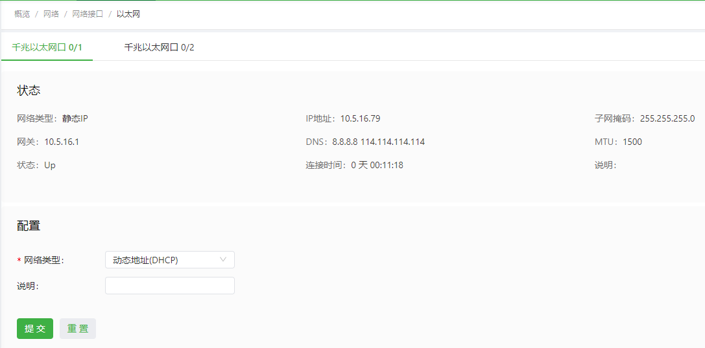

# InGateway902用户手册

  - [1. 设备简介](#equipment-introduction)
    - [1.1 概述](#overview)
    - [1.2 包装清单](#packing-list)
    - [1.3 面板介绍与结构尺寸](#panel-introduction-and-structure-size)
      - [1.3.1 面板介绍](#panel-introduction)
      - [1.3.2 结构尺寸](#structure-size)
    - [1.4 面板指示灯说明](#panel-indicator-description)
      - [1.4.1 面板LED指示灯说明](#panel-led-indicator-description)
      - [1.4.2 信号状态指示灯说明](#signal-status-indicator-description)
  - [2. 设备安装](#device-installation)
    - [2.1 安装注意事项](#installation-precautions)
    - [2.2 导轨式安装与拆卸](#guide-rail-installation-and-disassembly)
      - [2.2.1 导轨式安装设备](#rail-mounting-equipment)
      - [2.2.2 导轨式拆卸设备](#rail-type-disassembly-equipment)
    - [2.3 壁挂式安装与拆卸](#wall-mounted-installation-and-disassembly)
      - [2.3.1 壁挂式安装](#wall-mounted-installation)
      - [2.3.2 壁挂式拆卸](#wall-mounted-disassembly)
    - [2.4 SIM卡安装](#sim-card-installation)
    - [2.5 天线安装](#antenna-installation)
    - [2.6 电源安装](#power-installation)
    - [2.7 保护地接地安装](#protective-earth-ground-installation)
    - [2.8 网线连接](#network-cable-connection)
    - [2.9 端子连接](#terminal-connection)
  - [3. 设备配置说明](#device-configuration-instructions)
    - [3.1 访问网关](#access-gateway)
    - [3.2 概览](#overview2)
    - [3.3 网络](#network)
      - [3.3.1 网络接口](#network-interface)
        - [3.3.1.1 蜂窝网](#cellular-network)
        - [3.3.1.2 以太网](#ethernet)
        - [3.3.1.3 WLAN](#wlan)
        - [3.3.1.4 桥接口](#bridge-interface)
        - [3.3.1.5 环回接口](#loopback-interface)
      - [3.3.2 网络服务](#internet-service)
        - [3.3.2.1 DHCP服务](#dhcp-service)
          - [3.3.2.1.1 DHCP服务器](#dhcp-server)
          - [3.3.2.1.2 DHCP中继](#dhcp-relay)
        - [3.3.2.2 DNS服务](#dns-service)
        - [3.3.2.3 GPS](#gps)
        - [3.3.2.4 主机列表](#host-list)
      - [3.3.3 路由](#static-routing)
        - [3.3.3.1 路由状态](#static-routing-status)
        - [3.3.3.2 静态路由](#static-routing-configuration)
      - [3.3.4 防火墙](#firewall)
        - [3.3.4.1 访问控制列表](#acl)
        - [3.3.4.2 网络地址转换](#nat)
    - [3.4 边缘计算](#edge-computing)
      - [3.4.1 Python边缘计算](#python-edge-computing)
      - [3.4.2 Docker管理](#docker-management)
    - [3.5 系统管理](#system-management)
      - [3.5.1 系统时间](#system-time)
      - [3.5.2 系统日志](#system-log)
      - [3.5.3 配置管理](#configuration-management)
      - [3.5.4 设备远程监控平台](#equipment-remote-monitoring-platform)
      - [3.5.5 固件升级](#firmware-upgrade)
      - [3.5.6 管理工具](#management-tools)
      - [3.5.7 用户管理](#user-management)
      - [3.5.8 重启](#reboot)
      - [3.5.9 工具](#tools)
      - [3.5.10 第三方软件声明](#third-party-software-statement)
    - [3.6 导航栏操作](#navigation-bar-operation)
      - [3.6.1 返回首页](#back-to-top)
      - [3.6.2 退出登录](#sign-out)
      - [3.6.3 切换语言](#switch-language)
  - [4. 高级功能](#advanced-features)
    - [4.1 管理](#management)
      - [4.1.1 系统](#system)
      - [4.1.2 AAA](#aaa)
        - [4.1.2.1 Radius](#radius)
        - [4.1.2.2 Tacacs+](#tacacs)
        - [4.1.2.3 LDAP](#ldap)
        - [4.1.2.4 AAA认证](#aaa-certification)
      - [4.1.3 告警](#alarm)
    - [4.2 链路备份](#link-backup)
      - [4.2.1 SLA](#sla)
      - [4.2.2 Track模块](#track-module)
      - [4.2.3 VRRP](#vrrp)
      - [4.2.4 接口备份](#interface-backup)
    - [4.3 路由](#route)
      - [4.3.1 静态路由](#static-route)
      - [4.3.2 动态路由](#dynamic-route)
        - [4.3.2.1 RIP](#rip)
        - [4.3.2.2 OSPF](#ospf)
        - [4.3.2.3 路由策略](#routing-strategy)
      - [4.3.3 组播路由](#multicast-routing)
        - [4.3.3.1 基本设置](#basic-settings)
        - [4.3.3.2 IGMP](#igmp)
    - [4.4 VPN](#vpn)
      - [4.4.1 IPsec](#ipsec)
        - [4.4.1.1 IPsec配置](#ipsec-configuration)
        - [4.4.1.2 IPsec扩展](#ipsec-extension)
      - [4.4.2 GRE](#gre)
      - [4.4.3 L2TP](#l2tp)
        - [4.4.3.1 L2TP客户端](#l2tp-client)
        - [4.4.3.2 L2TP服务器](#l2tp-server)
      - [4.4.4 OpenVPN](#openvpn)
        - [4.4.4.1 OpenVPN客户端](#openvpn-client)
        - [4.4.4.2 OpenVPN服务器](#openvpn-server)
      - [4.4.5 证书管理](#certificate-management)
    - [4.5 工业接口](#industrial-interface)
      - [4.5.1 DTU](#dtu)
        - [4.5.1.1 串口设置](#serial-port-settings)
        - [4.5.1.2 DTU1](#dtu1)
        - [4.5.1.3 DTU2](#dtu2)
      - [4.5.2 IO接口](#io-interface)
    - [4.6 快速向导](#quick-guide)
      - [4.6.1 新建LAN](#new-lan)
      - [4.6.2 新建WAN](#new-wan)
      - [4.6.3 新建拨号](#new-dial)
      - [4.6.4 新建IPsec隧道](#new-ipsec-tunnel)
  - [5. FAQ](#faq)
    - [5.1 如何通过硬件恢复出厂设置](#how-to-restore-factory-settings-through-hardware)

## 1. 设备简介

### 1.1 概述
InGateway902（以下简称IG902）系列边缘计算网关是映翰通公司面向工业物联网领域推出的新一代 4G 边缘计算网关。该产品凭借全球部署的 3G/4G 无线网络和多种宽带服务，提供随处可得的不间断的互联网接入。以其强大的边缘计算能力、全面的安全性和无线服务等特性，实现多达万级的设备联网，为真正意义上的设备信息化提供数据的高速通路。  
IG902 拥有强劲的边缘计算能力，在物联网边缘节点实现数据优化、实时响应、敏捷连接、智能分析；显著减少现场与中心端的数据流量，并避免云端运算能力遇到瓶颈。优化网络架构，更安全、更快响应，同时更智能化实现现场业务。  

IG902常见的应用场景如下图所示：  

  

### 1.2 包装清单
每一台出厂的IG902产品，都包含了客户现场的常用配件（如标准配件列表），当您收到我们的产品后，请仔细检查，如果发现有缺失或者损坏现象，请及时联系映翰通销售人员。  
此外，映翰通可根据不同现场特点向客户提供可选配件，详情请见可选配件列表。  
- 标准配件  
  <table>
      <thead>
          <tr>
              <th>
配件
</th>
              <th>数量</th>
              <th>
描述
</th>
          </tr>
      </thead>
      <tbody>
          <tr>
              <th>
IG902
</th>
              <th>
1台
</th>
              <th>
IG902边缘计算网关
</th>
          </tr>
          <tr>
              <th>
产品资料
</th>
              <th>
1份
</th>
              <th>
二维码快速安装手册、用户手册
</th>
          </tr>
          <tr>
              <th>
导轨安装配件
</th>
              <th>
1个
</th>
              <th>
固定网关
</th>
          </tr>
          <tr>
              <th>
电源端子
</th>
              <th>
1个
</th>
              <th>
7针工业端子
</th>
          </tr>
          <tr>
              <th>
网线
</th>
              <th>
1根
</th>
              <th>
1.5m网线
</th>
          </tr>
          <tr>
              <th>
天线
</th>
              <th>
1根
</th>
              <th>
3G/4G天线
</th>
          </tr>
          <tr>
              <th>
产品保修卡
</th>
              <th>
1张
</th>
              <th>
保修期为1年
</th>
          </tr>
          <tr>
              <th>
合格证
</th>
              <th>
1张
</th>
              <th>
IG902边缘计算网关合格证
</th>
          </tr>
      </tbody>
  </table>    

- 可选配件  
  <table>
      <thead>
          <tr>
              <th>
配件
</th>
              <th>数量</th>
              <th>
描述
</th>
          </tr>
      </thead>
      <tbody>
          <tr>
              <th>
AC电源线
</th>
              <th>
1根
</th>
              <th>
中标AC线
</th>
          </tr>
          <tr>
              <th>
电源适配器
</th>
              <th>
1个
</th>
              <th>
12VDC电源适配器
</th>
          </tr>
          <tr>
              <th rowspan="2">
天线
</th>
              <th>
1根
</th>
              <th>
Wi-Fi天线
</th>
          </tr>
          <tr>
              <th>
1根
</th>
              <th>
GPS天线
</th>
          </tr>
          <tr>
              <th>
串口线
</th>
              <th>
1根
</th>
              <th>
网关串口调试线
</th>
          </tr>
      </tbody>
  </table>

### 1.3 面板介绍与结构尺寸

#### 1.3.1 面板介绍
IG902的面板介绍如下图所示（IG902系列产品有多种面板外观形式，但是安装方法都是一样的，具体面板情况请以实物为准）：  

  

#### 1.3.2 结构尺寸
IG902的结构尺寸如下图所示：  

  

### 1.4 面板指示灯说明

#### 1.4.1 面板LED指示灯说明
  

  

说明：两个SIM卡指示灯，在“开机状态”和“开机成功”时都是SIM卡1指示灯亮，后四种情况是使用的SIM卡对应指示灯亮，图是以使用SIM卡1为例说明的。

#### 1.4.2 信号状态指示灯说明
信号：1-9（此时说明信号状况有问题，请检查天线是否安装完好，所处地区信号状况是否良好）  

  

信号：10-19（此时说明信号状态基本正常，设备能保持正常工作）  

  

信号：20-31（信号级别非常好）

## 2. 设备安装

### 2.1 安装注意事项
- 电源要求：24VDC(12～48VDC) ，请注意电源电压等级；额定电流是 0.6A（1.2～0.3A）。    
- 环境要求：工作温度-25℃～75℃，存储温度-40℃～85℃，相对湿度5％～95%（无凝露）。设备表面可能高温，安装时需要考虑周边环境，应安装在受限制的区域。  
- 避免阳光直射，远离发热源或有强烈电磁干扰区域。
- 网关产品需安装在工业导轨上。
- 检查是否有安装所需的电缆和接头。

### 2.2 导轨式安装与拆卸

#### 2.2.1 导轨式安装设备
安装IG902的具体步骤如下：  
1. 选定设备的安装位置，确保有足够的空间；  
2. 将DIN卡轨座的上部卡在DIN轨上，在设备的下端向上稍微用力按箭头2所示转动设备，即可将DIN卡轨座卡在DIN轨上，确认设备可靠地安装到DIN轨上如下图中的右图所示：   

    

#### 2.2.2 导轨式拆卸设备
拆卸IG902的方法为：  
1. 如下图箭头1所示，向下压设备使设备下端有空隙脱离DIN轨。  
2. 将设备按箭头2的方向转动，并同时向外移动设备的下端，待下端脱离DIN轨后向上抬设备，即可从DIN轨上取下设备。  

      

### 2.3 壁挂式安装与拆卸

#### 2.3.1 壁挂式安装
安装IG902的具体步骤如下：  
1. 选定设备的安装位置，确保有足够的空间。
2. 用螺丝刀把壁挂安装板安装在设备的后面，如下图所示  

    

3. 取出螺钉（与壁挂安装板配套包装），用螺丝刀将螺钉固定在安装位置上，然后下拉设备使设备处于稳定状态，如下图所示   

       

#### 2.3.2 壁挂式拆卸
拆卸IG902的方法为：用一只手扶住设备，另外一只手把设备上端起固定作用的螺钉卸掉，即可把设备从安装位置拆卸掉。

### 2.4 SIM卡安装
IG902支持双卡，用螺丝刀扭开卡座盖上面的固定螺丝后，装入SIM卡即可，如下图所示：  

  

### 2.5 天线安装
用手轻轻转动金属SMAJ接口可活动部分到不能转动（此时看不到天线连接线外螺纹）即可，不要握住黑色胶套用力拧天线。如下图所示：  

  

说明：
- IG902支持双天线，分别是ANT天线和AUX天线。其中ANT天线是收发数据的天线，AUX天线只能增强天线信号强度，不能独立进行数据的收发，因此不能单独使用。  
- 一般情况下只使用ANT天线即可，当信号不好需要增强信号时才在使用ANT天线的同时使用AUX天线。

### 2.6 电源安装
安装IG902电源的具体步骤如下：  
1. 将端子从网关上取下；  
2. 将端子上的锁紧螺钉旋松；  
3. 将电源线缆插入端子后将螺钉锁紧。  

      

### 2.7 保护地接地安装
安装IG902保护地接地的具体步骤如下：  
1. 将接地螺帽拧下来；
2. 将机柜地线的接地环套进接地螺柱上；
3. 将接地螺帽拧紧。

说明：为提高网关的整机抗干扰能力，网关在使用时必须接地，根据使用环境将地线接到网关接地螺柱上。

### 2.8 网线连接
使用网线将网关和PC直连，如下图所示：  

  

### 2.9 端子连接
端子提供RS232/RS485两种接口模式，在使用前需要将对应的线接到端子上。安装时将端子从设备上取下，将端子上的锁紧螺钉旋松，将对应线缆插入端子后将螺钉锁紧。各个线排序如下图所示：  

说明：该端子说明只适用于带有工业接口的IG902设备。

## 3. 设备配置说明

### 3.1 访问网关
- 步骤1：IG902的GE 0/2口的默认ip地址为**192.168.2.1**，设置PC的IP地址与GE 0/2口处于同一网段。  
  - 方法一：自动获取IP地址（推荐）  

     

  - 方法二：使用固定IP地址  

    选择“使用下面的IP地址”，输入IP地址（默认为192.168.2.2~192.168.2.254中任意值）；子网掩码（默认255.255.255.0）；默认网关（默认为192.168.2.1）以及DNS服务器地址，单击<确定>。  

    

- 步骤2：打开浏览器，访问IG902的GE 0/2口IP地址并输入登录用户名和密码。设备出厂的用户名/密码默认为**adm/123456**。  

  

- 步骤3：登录成功后，您可以看到如下图所示的网页。

  

### 3.2 概览
“概览”页面展示了IG902的网络连接状态、系统信息和数据使用情况等信息，你可以通过该页面快速了解到IG902的运行情况。  
登录IG902 WEB页面后默认展示“概览”页面，或者点击“概览”进入此页面，页面展示的信息如下：
- 网络连接状态：展示IG902的网络连接情况以及网络配置。
  - 外部网络状态：点击“设置”后跳转至[静态路由](#static-routing)页面。
  - GE 0/1网络状态：点击“设置”后跳转至[以太网](#ethernet)页面。
  - GE 0/2网络状态：点击“设置”后跳转至[以太网](#ethernet)页面。

    

- 边缘计算：展示Python边缘计算状态信息。  

    

- 数据使用监测：展示最近24小时的流量使用情况，每小时生成一条数据。  

    

- CPU负载：展示最近1分钟、5分钟、15分钟的CPU使用情况。  

    

- 内存：展示当前内存使用情况。  

    

- 系统信息：点击“编辑”按钮可修改IG902的名称  

   

### 3.3 网络

#### 3.3.1 网络接口

##### 3.3.1.1 蜂窝网
“蜂窝网”页面展示了IG902的拨号接口配置情况和状态信息，你可以在此页面配置拨号接口参数实现IG902的蜂窝网络连接功能或者查看详细的状态信息。配置拨号接口的步骤如下：
1. 选择“网络 > 网络接口 > 蜂窝网”，进入“蜂窝网”界面。  
2. 勾选“启用蜂窝网”。
3. 依次配置各项参数（通常使用默认配置即可），参数说明见[蜂窝网参数说明](#cellular-parameter-description)。
4. 单击“提交”，完成拨号接口的配置。

   

蜂窝网参数说明如下： 
- 启用蜂窝网：启用/关闭蜂窝网  
- 拨号参数集  
  - 网络类型：用户选择设备所使用的移动网络类型，可选择GSM、CDMA。  
  - APN：APN（Access Point Name）用来标识 WCDMA/LTE 网络的业务种类，WCDMA/LTE 系统根据用户连接 WCDMA/LTE 网络的 APN 提供相应的服务。(CDMA2000 系列不设置此项)   
  - 拨号号码：拨号使用的拨号串。拨号串由运营商提供，请向运营商获取。  
    - 当 3G/LTE 数据卡支持 WCDMA 或 LTE 标准时，缺省拨号串为`*99***1#` 。  
    - 当 3G 数据卡支持 CDMA2000 标准时，缺省拨号串为`#777`。  
  - 认证方式  
    - 自动：自动选择一种认证方式
    - PAP:密码认证协议，通过两次握手提供一种简单明文认证方式。  
    - CHAP:挑战握手认证协议，通过三次握手确认摘要信息从而进行安全认证。  
    - MS-CHAP:微软公司的 CHAP 标准。  
    - MS-CHAPv2:MS-CHAP 升级版本，它要求双向验证。  
  - 用户名：指定接入外部 PDN 网络用户的用户名。由运营商提供。缺省用户名为`gprs`。  
  - 密码：指定接入外部 PDN 网络用户的密码。由运营商提供。缺省用户名为`gprs`。  
- 启用双SIM卡：启用/关闭双SIM卡
  - 选择主卡：支持SIM1、SIM2、随机、顺序四种方式
  - 最大拨号次数：当 SIM1 在设置的最大拨号次数内一直没拨号成功,设备将切换到 SIM2 拨号
  - 最小连接时间：当设备拨号连接成功时间小于设置的最小连接时间时，设备的拨号次数会累计。当大于设置的最小连接时。设备的拨号次数将清零。0 是禁用此功能
  - 备卡超时时间：当前使用的为被卡，被卡拨号成功后，当达到设定的被卡超时时间后，设备会切换到主卡拨号
- 网络选择方式：支持自动、3G、4G、3G2G四种网络。用户根据所使用设备及 SIM 卡适用的情况，可选择特定的网络方式，或使用自动方式，设备可自行注册到适用当前网络状况的网络方式。  
- 拨号参数集：拨号策略选择，对应于拨号参数集配置索引项。  
- 启用漫游：勾选启用漫游功能，在漫游状态下可以正常拨号上网，当取消漫游选项，漫游的 SIM 卡不能拨号上网使用本地卡时，勾选漫游和取消漫游功能都不影响 SIM 卡拨号上网。  
- PIN code：PIN 码即 SIM 卡的个人识别密码。如果启用 PIN 码，当不设置 PIN 码或设置错误的 PIN 码，设备拨号失败；设置正常的 PIN 码，设备可以正常拨号上网。  
- 静态IP：拨号时是否使用静态 IP，可以手动指定 IP 地址。设备每次拨号都获得配置的静态 IP。  
- 连接方式   
  - 永远在线：永远在线是系统默认拨号方式，正常状态下设备一直在线只有拨号口没有任何流量时会 30 分钟掉线重新拨号。
  - 按需拨号  
    - 数据激活：默认设备为不在线状态，当有去往公网数据时，自动拨号成功。  
  - 手工拨号：通过蜂窝网界面状态中的的“连接”和“断开”按钮连接和断开网络连接。  
- 重拨间隔：设备每次掉线重新拨号等待的时间。  
- ICMP探测  
  - ICMP探测服务器：要探测的远端 IP 地址或域名（同时启用两个 ICMP 探测服务器，建议同时输入 IP 地址或同时输入域名）。设备支持两个 ICMP 探测服务器：主服务器和备份服务器。当配置两个服务器后，首先检测第一个服务器，只有当第一个服务器达到最大重试次数后，系统才会检测第二个服务器。当两个服务器都检测失败的情况下，设备会重新拨号并进行下一轮 ICMP 探测。  
  - ICMP探测间隔时间：设备发送 ICMP 探测报文的时间间隔。  
  - ICMP探测超时时间：在设置的 ICMP 探测超时时间内，没有收到 ICMP 响应包认为本次 ICMP 探测超时。  
  - ICMP探测最大重试次数：设置 ICMP 探测失败时的最大重试次数（达到最大次数后会重新拨号）。  
  - ICMP严格探测：当设备的拨号接口有数据流量时。设备不发送 ICMP 探测。当拨号接口没有数据流量时候才会发送 ICMP 探测，可以达到节省流量目的。  
- 高级设置  
  - 初始化命令：可以配置一些 AT 指令查询模块状态。  
  - 信号查询间隔：设备拨号成功后，将以设置的查询间隔时间定时查询信号状态。如设置查询间隔时间为 60s。设备拨号成后，拔下设备天线，等到 60s 后设备信号应该降低，在 60s 内设备信号不发生变化。0 表示禁用。  
  - 拨号超时时间：在设定的超时时间内，设备未成功拨号，认为拨号超时，设备重新检测模块并重新拨号。  
  - MRU：最大接收单元，以字节为单位。  
  - MTU：最大传输单元，以字节为单位。  
  - 启用缺省的 Asyncmap：启用/禁用缺省的Asyncmap
  - 使用分配的DNS服务器：启用后使用拨号网络连接中分配的DNS服务器
  - 连接检测间隔：每间隔指定时间检测拨号连接是否正常
  - 连接检测最大重试次数：检测连接断开后的重试次数
  - 无限地拨号重试：启用后如果拨号失败则无限的重试
  - 启用调试模式：启用调试模式后系统日志将打印更为详细的信息。  
  - 专家选项：可以在专家选项中配置相应的命令参数

##### 3.3.1.2 以太网
“以太网”页面展示了IG902的以太网接口配置情况和状态信息，你可以在此页面配置以太网接口参数或者查看详细的状态信息。配置以太网接口的步骤如下：
1. 选择“网络 > 网络接口 > 以太网 > 千兆以太网 0/1”，进入“以太网”界面。  
2. 选择GE 0/1接口的网络类型。    
3. 依次选择或输入各项参数，参数说明见[以太网参数说明](#ethernet-parameter-description)。  
4. 单击“提交”，完成GE 0/1接口的配置。  
5. 选择“网络 > 网络接口 > 以太网 > 千兆以太网 0/2”。（GE 0/2口默认是桥接在bridge口的，需要从bridge口删除`gigabitethernet 0/2`后，才能单独配置GE 0/2口）
6. 选择GE 0/2接口的网络类型。
7. 依次选择或输入各项参数，参数说明见[以太网参数说明](#ethernet-parameter-description)。  
8. 单击“提交”，完成GE 0/2接口的配置。

配置GE 0/1接口（网络类型为DHCP），如下图所示：  

  

配置GE 0/1接口（网络类型为静态IP），如下图所示：  

  

配置GE 0/2接口（网络类型为静态IP），如下图所示：  

  

   

以太网参数说明如下：  
- 网络类型（默认为静态IP）  
  - 静态IP：手动为以太网接口配置IP地址和子网掩码等信息  
  - 动态地址（DHCP）：配置接口作为DHCP客户端，使用DHCP方式获取IP地址和子网掩码等信息  
- 静态IP模式
  - 主IP：以太网接口的IP地址，GE 0/1口默认值为192.168.1.1，GE 0/2口默认值为192.168.2.1。
  - 子网掩码：以太网接口的子网掩码。  
  - MTU：最大传输单元，以字节为单位，默认值为1500。  
  - 端口速率/端口模式  
    - 自动协商
    - 1000M 全双工
    - 1000M 半双工
    - 100M 全双工
    - 100M 半双工
    - 10M 全双工
    - 10M 半双工
  - 二层状态联动：开启后，端口没物理连接状态为 Down，有物理连接时为 UP；关闭后，端口有无物理连接时都显示 UP。
  - 关闭：禁用该接口  
  - 说明：以太网接口的描述信息，标识作用。
  - 从IP支持：除主 IP 以外用户还可以配从 IP 地址，最多可以配置 10 个。  
- DHCP模式
  - 说明：以太网接口的描述信息，标识作用。 

##### 3.3.1.3 WLAN
“WLAN”页面展示了IG902的WLAN配置情况和状态信息，你可以在此页面配置WLAN参数或者查看详细的状态信息。配置WLAN的步骤如下：  
1. 选择“网络 > 网络接口 > WLAN”，进入“WLAN”界面。
2. 勾选“启用Wi-Fi”并依次选择或输入各项参数，参数说明见[WLAN参数说明](#wlan-parameter-description)  
3. 单击“提交”，完成WLAN的配置。  

配置WLAN为接入点，如下图所示：  

  

配置WLAN为客户端，如下图所示：

  

   

WLAN参数说明如下：  
- 启用Wi-Fi：启用或禁用 WLAN 服务。启用 WLAN 服务后，可以配置无线网络的基本参数和安全认证选项，使得无线接入的用户可以实现接入 Internet。
- 接口类型：选择 WLAN 工作模式，可选择客户端和接入点
- 客户端模式
  - 默认路由：启用后，自动添加一条WLAN路由信息
  - 客户端SSID：填写要连接的 SSID 名称
  - 认证方式：和要连接的 SSID 的认证方式保持一致
  - 加密方式：和要连接的 SSID 的加密方式保持一致
  - WPA/WPA2 PSK密钥：和要连接的 SSID 的密钥保持一致
  - 网络类型：和要连接的 SSID 的网络类型保持一致
- 接入点模式
  - SSID广播：开启 SSID 广播后无线客户端能扫描到此 SSID.禁用即隐藏 SSID,SSID 隐藏后，设备发送的信标帧里面不包含 SSID 信息，接入客户端必须在无线客户端上手动配置该 SSID 标识才能接入设备
  - AP隔离：开启 AP 客户端隔离功能后，AP 下接入的所有用户之间的二层报文相互不能进行转发，提高了用户通信安全性
  - 桥接：启用后将WLAN桥接至桥接口
  - 无线频段：该AP的无线频段，支持2.4G和5G
  - 射频类型：六种类型可选：802.11g/n、802.11g、802.11n、802.11b、802.11b/g 、802.11b/g/n
    - 802.11b：工作在 2.4G 频段，最高速率 11Mbps
    - 802.11g：工作在 2.4G 频段，最高速率 54Mbps
    - 802.11n：工作在 2.4G 频段，也可以工作在 5G 频段，理论最高速率 300Mbps
  - 信道：信道是以无线信号作为传输媒体的数据信号传送通道，共有 13 个信道，每个信道的载波频率不同
    - 信道 1，中心频率 2.412GHz；
    - 信道 2，中心频率2.417GHz
    - 信道 3，中心频率 2.422GHz；
    - 信道 4，中心频率2.427GHz
    - 信道 5，中心频率 2.432GHz；
    - 信道 6，中心频率2.437GHz
    - 信道 7，中心频率 2.442GHz；
    - 信道 8，中心频率2.447GHz
    - 信道 9，中心频率 2.452GHz；
    - 信道 10，中心频率2.457GHz
    - 信道 11，中心频率 2.462GHz；
    - 信道 12，中心频率2.467GHz
    - 信道 13，中心频率 2.472GHz
  - SSID：服务集标识。SSID 技术可以将一个无线局域网分为几个需要不同身份验证的子网络，每一个子网络都要独立的身份认证，只有通过身份认证的用户才可以进入相应的子网络，防止未被授权的用户进入网络
  - 认证方式：五种认证方式可选：开放式、共享式、WPA-PSK、WPA2-PSK、WPAPSK/WPA2PSK。加密的认证方式目前有三种认证方式：WPA-PSK、WPA2-PSK、WPAPSK/WPA2PSK
  - 加密方式：支持TKIP和AES加密
  - WPA/WPA2 PSK密钥：认证密钥，密钥长度为8-63
  - 无线频宽：指定该 AP 射频对应的信道带宽，可选择 20MHz、40MHz
  - 最大客户端数：设置设备支持的最大客户端数目（最多 128 个）
  - IP地址：WLAN接口的IP地址（启用桥接口后无该项参数）
  - 子网掩码：WLAN接口的子网掩码（启用桥接口后无该项参数）

##### 3.3.1.4 桥接口
桥接口是IG902上的一个逻辑、虚拟接口，你可以通过桥接口将WLAN和GE 0/2口桥接到一起。（在WLAN中配置WIFI接口类型为客户端时网桥成员无法选择WLAN接口） 配置桥接口的步骤如下：
1. 选择桥接口的网桥成员
2. 配置桥接口参数，参数说明见[桥接口参数说明](#bridge-interface-parameter-description)
3. 点击“提交”保存配置

将WLAN接口与GE 0/2口桥接到一起，如下图所示：  

  

   

桥接口参数说明如下：  
- 主IP：桥接口主IP地址
- 子网掩码：桥接口子网掩码
- 从IP支持：除主 IP 以外用户还可以配从 IP 地址，最多可以配置 10 个
- 网桥成员
  - dot11radio 1：WLAN接口
  - gigabitethernet 0/2：GE 0/2接口

##### 3.3.1.5 环回接口
环回接口是IG902上的一个逻辑、虚拟接口，创建并配置好环回接口之后，它的地址是能被 ping 或 telnet 的，这就可以用来测试网络的连通性。你可以在“环回接口”页面配置或者查看环回接口参数。配置环回接口的步骤如下：
1. 选择“网络 > 网络接口 > 环回接口”，进入“环回接口”界面。你可以在此页面设置和查看环回接口的网络参数。  
2. 单击“从IP支持”中的“添加”按钮新增环回接口从IP（默认提供127.0.0.1的环回接口）。    
3. 依次输入IP地址和子网掩码参数。  
4. 单击“提交”，完成环回接口的配置。 

添加环回接口从IP：127.0.0.2，如下图所示：  

注意：最多可以配置 10 个从IP地址。

#### 3.3.2 网络服务

##### 3.3.2.1 DHCP服务

###### 3.3.2.1.1 DHCP服务器
DHCP 采用客户端/服务器通信模式，由客户端向服务器提出配置申请，服务器返回为客户端分配的 IP 地址等相应的配置信息，以实现 IP 地址等信息的动态配置。你可以在“DHCP服务器”页面设置和查看DHCP服务器的配置情况。DHCP服务器配置步骤如下：
1. 选择“网络 > 网络服务 > DHCP服务 > DHCP服务器”，进入DHCP服务器界面；  
2. 点击“添加”或“编辑”按钮配置DHCP服务；  
3. 依次配置各项参数，参数说明见[DHCP服务器参数说明](#dhcp-server-parameter-description)；  
4. 点击“确定”保存配置并点击“提交”应用配置。  

配置DHCP服务器，如下图所示：  

  

  

- DHCP服务器参数说明如下：
  - 启用DHCP服务：启用/关闭DHCP服务。注意：DHCP 服务器和 DHCP 中继不能同时被启用。
  - 接口：支持Gigabitethernet 0/1、Gigabitethernet 0/2、Bridge 1和Dot11radio 1接口。仅支持WIFI功能的IG902具备Bridge 1和Dot11radio 1接口
  - 起始地址：设置地址池中分配给客户端设备的起始 IP 地址。
  - 结束地址：设置地址池种分配给客户端设备的结束 IP 地址。
  - 有效期：设置分配 IP 的地址的有效期，过期 DHCP 服务器将回收分配给客户端的 IP 地址并重新分配 IP 地址，不能为空。  
- Windows名称服务器(WINS)：WINS 服务器的 IP 地址。
- 静态IP设置：你可以通过静态IP设置来配置指定MAC地址使用固定的IP地址，如下图:  

  

###### 3.3.2.1.2 DHCP中继
DHCP中继（也叫做DHCP中继代理）可以实现在不同子网和物理网段之间处理和转发DHCP信息的功能。你可以在“DHCP中继”页面设置和查看DHCP中继的配置情况。DHCP中继配置步骤如下：  
1. 选择“网络 > 网络服务 > DHCP服务 > DHCP中继”，进入“DHCP中继”界面。  
2. 启用DHCP中继，需关闭DHCP服务器。  
3. 配置DHCP服务器地址和中继接口，参数说明见[DHCP中继参数说明](#dhcp-relay-parameter-description)。  
4. 点击“提交”应用配置。  

配置DHCP中继，如下图所示：  

DHCP中继参数说明如下：
- 启用DHCP中继：开启/关闭DHCP中继，不能同时启用DHCP中继和DHCP服务器
- DHCP服务器：DHCP服务器地址。
- 中继接口：作为DHCP中继的网络接口。

##### 3.3.2.2 DNS服务
域名系统（DNS，Domain Name System）是一种用于 TCP/IP 应用程序的分布式数据库，提供域名与 IP 地址之间的转换。通过域名系统，用户进行某些应用时，可以直接使用便于记忆的、有意义的域名，而由网络中的 DNS 服务器将域名解析为正确的 IP 地址。你可以在“DNS服务”页面设置和查看域名服务器及DNS中继服务。
- 域名服务器配置步骤如下：
  1. 选择“网络 > 网络服务 > DNS服务”，进入DNS服务界面。  
  2. 填写DNS服务器地址。
  3. 点击“提交”应用配置。

  配置DNS服务器，如下图所示：  

  

- DNS中继服务配置步骤如下：
  1. 选择“网络 > 网络服务 > DNS服务”，进入DNS服务界面。  
  2. 启用DNS中继服务，启用DHCP服务器时，不可关闭DNS中继服务。
  3. 点击添加按钮添加一个“[ 域名<=>IP地址 ] 对”
  4. 配置主机域名或IP地址，并配置对应的IP地址。
  5. 点击“确定”保存配置并点击“提交”应用配置。
   
  配置DNS中继服务，如下图所示：  

  

##### 3.3.2.3 GPS
你可以在“GPS”页面开启或关闭 GPS 功能，查看IG902的GPS定位信息，配置 GPS IP 转发和 GPS 串口转发，其中 GPS IP 转发有两种类型：客户端和服务器端。
选择“网络 > 网络服务 > GPS”，进入“GPS”界面，如下图所示：  

  

配置GPS转发的步骤如下：
1. 在“配置”中勾选“开启GPS”
2. 勾选GPS IP转发或GPS串口转发
3. 配置相应的参数，参数说明见[GPS IP转发参数说明](#gps-ip-parameter-description)和[GPS串口转发参数说明](#gps-serial-parameter-description)（GPS 串口转发和 DTU 功能不能同时使用，开启 GPS 串口转发时必须关闭 DTU 功能）
4. 点击提交以保存配置。

配置GPS IP转发，如下图所示：  

  

配置GPS串口转发，如下图所示：  

  

GPS IP转发参数说明如下：  
- 启用：启用/关闭GPS IP转发
- 类型：GPS IP转发类型
  - 客户端
    - 传输协议：两种协议可选，TCP 协议和 UDP 协议
    - 连接类型：两种类型可选：长连接和短连接。需与服务器端保持一致
    - 心跳间隔：当 TCP 连接建立成功后，设备发送心跳的时间间隔
    - 心跳重试次数：心跳超时后，继续发送心跳的次数，当达到设置的次数心跳还是超时，设备断开 TCP 连接 
    - 最小重连间隔：设备建立 TCP 连接时，开始使用的连接时间间隔，每 30 秒递增直到最大重连间隔
    - 最大重连间隔：设备建立 TCP 连接时最大重连间隔时间
    - 源接口：设备连接服务器时，使用源接口的地址作为源地址去建立 TCP 连接
    - 上报信息间隔：设备上报 GPS 信息的时间间隔
    - 包含RMC：是否发送 GPS 数据的 PMC 数据
    - 包含GSA：是否发送 GPS 数据的 GSA 数据
    - 包含GGA：是否发送 GPS 数据的 GGA 数据
    - 包含GSV：是否发送 GPS 数据的 GSV 数据
    - 消息前缀：设备发送 GPS 消息时用户自定义的报文头内容
    - 消息后缀：设备发送 GPS 消息时用户自定义的报文结尾内容
  - 服务器
    - 连接类型：两种类型可选，长连接和短连接。需与客户端保持一致
    - 心跳间隔：当 TCP 连接建立成功后，设备发送心跳的时间间隔
    - 心跳重试次数：心跳超时后，继续发送心跳的次数，当达到设置的次数心跳还是超时，设备断开 TCP 连接 
    - 本地端口号：设备当 TCP SERVER 时定义的服务端口号
    - 上报信息间隔：设备上报 GPS 信息的时间间隔
    - 包含RMC：是否发送 GPS 数据的 PMC 数据
    - 包含GSA：是否发送 GPS 数据的 GSA 数据
    - 包含GGA：是否发送 GPS 数据的 GGA 数据
    - 包含GSV：是否发送 GPS 数据的 GSV 数据
    - 消息前缀：设备发送 GPS 消息时用户自定义的报文头内容
    - 消息后缀：设备发送 GPS 消息时用户自定义的报文结尾内容  

GPS串口转发参数说明如下：  
- 启用：启用/关闭GPS串口转发
- 串口类型：和对端保持一致(RS232/RS485)
- 波特率：和对端保持一致
- 数据位：和对端保持一致
- 校验位：和对端保持一致
- 停止位：和对端保持一致
- 软件流控：启用/关闭软件流控
- 包含RMC：是否发送 GPS 数据的 PMC 数据
- 包含GSA：是否发送 GPS 数据的 GSA 数据
- 包含GGA：是否发送 GPS 数据的 GGA 数据
- 包含GSV：是否发送 GPS 数据的 GSV 数据

##### 3.3.2.4 主机列表
你可以在“主机列表”页面查看已连接到IG902的主机信息。
选择“网络 > 网络服务 > 主机列表”，进入“主机列表”界面，如下图所示：  

#### 3.3.3 路由

##### 3.3.3.1 路由状态
选择“网络 > 路由 > 路由状态”，进入“路由状态”界面。你可以在此页面查看路由状态信息，如下图所示：  

##### 3.3.3.2 静态路由
你可以在“静态路由”页面需要手工设置静态路由，设置后，去往指定目的地的报文将按照你指定的路径进行转发（一般不需要设置此项）。配置步骤如下：  
1. 选择“网络 > 路由 > 静态路由”，进入“静态路由”界面。
2. 点击“添加”按钮以添加一条静态路由配置
3. 依次配置各项参数，参数说明见[静态路由参数说明](#static-routing-parameter-description)
4. 点击“确定”保存配置并点击“提交”应用配置。

配置静态路由，如下图所示：  

静态路由参数说明如下：
- 目的网络：需要到达的目的 IP 地址
- 子网掩码：需要到达的目的地址的子网掩码
- 接口：数据到达目的网络使用的接口 
- 网关：数据在到达目的地址前，需要经过的下一个路由器 IP 地址
- 距离：即优先权，数值越小优先级越高
- Track标识：Track 的索引或 ID

#### 3.3.4 防火墙

##### 3.3.4.1 访问控制列表
ACL 即访问控制列表，通过配置一系列匹配规则，对指定数据流（如限定的源 IP 地址、账号等）执行允许或禁止通过，达到对网络接口数据的过滤。你可以在“访问控制列表”页面设置网络接口数据的过滤策略，配置步骤如下：
1. 选择“网络 > 防火墙 > 访问控制列表”，进入“访问控制列表”界面。  
2. 在“访问控制策略”中点击“添加”按钮添加一条访问控制策略
3. 依次配置各项参数，参数说明见[访问控制策略参数说明](#access-control-strategy-parameter-description)
4. 在“访问控制列表”中点击“添加”按钮或“编辑”按钮为指定接口配置访问控制
5. 依次配置各项参数，参数说明见[访问控制列表参数说明](#access-control-list-parameter-description)
6. 点击“确定”保存配置并点击“提交”应用配置。

配置标准访问控制策略，如下图所示：  

  

配置扩展访问控制策略，如下图所示：  

  

配置访问控制列表，如下图所示：  

- 标准访问控制策略参数说明如下：
  - ID：ACL 规则ID，范围 1-99，数值越小则优先级越高
  - 序号：ACL 规则序号，数值越小则优先级越高
  - 动作：允许/拒绝报文通过
  - 源IP地址：ACL 规则匹配报文的源地址，为空时表示 any，即所有网络。
  - 源地址反掩码：ACL 规则匹配报文的源地址反掩码
  - 记录日志：启用后系统会记录关于访问控制方面的日志。
  - 说明：便于记录访问控制各项参数意义。

- 扩展访问控制策略参数说明如下：
  - ID：ACL 规则ID，范围 100-199，数值越小则优先级越高
  - 序号：ACL 规则序号，数值越小则优先级越高
  - 动作：允许/拒绝报文通过
  - 协议：访问控制协议
  - 源IP地址：ACL 规则匹配报文的源地址，为空时表示 any，即所有网络。
  - 源地址反掩码：ACL 规则匹配报文的源地址反掩码
  - 源端口：源端口号，any 表示 TCP/UDP 报文的任何源端口都匹配。协议为 TCP 或 UDP 时，才可以指定源端口号。
  - 目的IP地址：ACL 规则匹配报文的目的地址，为空时表示 any，即所有网络。
  - 目的地址反掩码：ACL 规则匹配报文的源地址反掩码
  - 目的端口：目的端口号，any 表示 TCP/UDP 报文的任何目的端口都匹配。协议为 TCP 或 UDP 时，才可以指定源端口号。
  - 已建立的连接：启用后则控制已建立 TCP 连接的报文，未建立连接的 TCP 报
文不控制；未启用则控制已建立和未建立的 TCP 报文。协议为 TCP 时，才可以配置此项参数。
  - 片段：控制数据包从接口发送出去时被分片的报文。
  - 记录日志：启用后系统会记录关于访问控制方面的日志。
  - 说明：便于记录访问控制各项参数意义。

- 访问控制列表参数说明如下：
  - 接口名称：需要设置访问控制策略的接口名称
  - 规则：选择入站、出站和管理规则

##### 3.3.4.2 网络地址转换
网络地址转换（NAT） 可以实现局域网内的多台主机通过 1 个或多个公网 IP 地址接入因特网，即用少量的公网 IP 地址代表较多的私网 IP 地址，节省公网的 IP 地址。你可以在“网络地址转换”页面查看和设置网络地址转换规则，配置步骤如下：
1. 选择“网络 > 防火墙 > 网络地址转换”，进入“网络地址转换”界面。  
2. 在“网络接口”中配置接口类型
3. 在“网络地址转换(NAT)规则”中点击“添加”按钮并配置网络地址转换规则，参数说明见[网络地址转换规则参数说明](#network-address-translation-rules-parameter-description)
4. 点击“确定”保存配置并点击“提交”应用配置。

配置IG902下端设备通过GE 0/2口IP地址连接外部网络，如下图所示：  

网络地址转换规则参数说明如下：
- 动作
  - SNAT：源地址转换，将 IP 数据包的源地址转换成另外一个地址。一般用于从路由器内部发往外部的数据。
  - DNAT：目的地址转换，将 IP 数据包的目的地址转换成另外一个地址。一般用于从路由器外部发往内部的数据。
  - 1:1NAT：1 对 1 转换 IP 地址。
- 源网络（动作为SNAT和DNAT时支持）：
  - Inside：内部地址
  - Outside：外部地址
- 转换类型
  - IP to IP
  - IP to INTERFACE
  - IP PORT to IP PORT
  - ACL to INTERFACE
  - ACL to IP
- 匹配访问控制列表（1:1NAT不支持）：根据配置的匹配规则来转换地址
- 转换成的地址（1:1NAT不支持）：转换后的IP地址或转换为哪个接口
- 描述信息：对一条 NAT 的作用的描述

### 3.4 边缘计算

#### 3.4.1 Python边缘计算
“Python边缘计算”页面展示了IG902的Python二次开发环境信息和IG902上的App配置信息及运行状态。你可以通过该页面的二次开发环境信息开发你的定制化Python App，也可以在此页面配置和查看App状态。  
Python环境配置步骤如下：
1. 选择“边缘计算 > Python边缘计算”，进入“Python边缘计算”界面；  
2. 启用Python边缘计算引擎；  
3. 安装/升级Python SDK；（非必须步骤）
4. 启用调试模式即可。如何进行Python二次开发请参考[Python开发快速入门](http://sdk.ig.inhand.com.cn/zh_CN/latest/MobiusPi-Python-QuickStart-CN.html)。

App配置步骤如下：
1. 选择“边缘计算 > Python边缘计算”，进入“Python边缘计算”界面；  
2. 启用Python边缘计算引擎；  
3. 安装/升级Python SDK；（非必须步骤）
4. 在“配置”中导入App包并勾选启用，App配置说明见[App配置功能说明](#app-configuration-function-description)；
5. 点击“提交”应用配置。

配置IG902Python开发环境，如下图所示：

配置App运行，如下图所示（以HelloWorld为例）：

App配置功能说明如下：
- App状态
  - 全部启动：启动所有已启用的App
  - 全部停止：停止所有已启用的App
  - 全部重启：重启所有已启用的App
  - 下载：下载指定App的运行日志
  - 删除：清空指定App的运行日志
  - 查看：查看指定App的运行日志
  - 停止：停止运行指定App
  - 重启：重启指定App
- App列表
  - 启用：启用App，启用后每次重启设备App都将自动运行
  - 启动参数：可在此处配置App的启动参数
  - 导出配置：导出App配置文件
  - 导入配置：导入App配置文件，导入配置文件并重启App后按照导入后的配置文件运行。
  - 卸载：卸载App
  - 添加：添加App

#### 3.4.2 Docker管理
IG902支持托管docker镜像，您可以将您的docker镜像发布到IG902上，快速部署和运行您自行开发的应用程序。  
Docker环境配置步骤如下：  
1. 安装Docker SDK；
2. 启用Docker管理器；
3. 进入Docker管理页面（portianer）配置镜像和容器。

启用Docker管理器，如下图所示：  

  

Docker管理页面的参数说明如下：
- 启用Docker管理器：启用/禁用Docker管理器
- Docker版本：安装或升级Docker版本
- 用户名：用于登录portianer的用户名
- 密码：用于登录portianer的密码
- 端口号：用于访问portianer的端口号，默认为9000
- Docker镜像：可以在此处导入相应的docker镜像

### 3.5 系统管理

#### 3.5.1 系统时间
为了保证IG902与其它设备协调工作，你可能需要将系统时间配置准确。为此，你可以在“系统时间”页面设置IG902的系统时间以及通过NTP对网络内所有具有时钟的设备进行时钟同步，使网络内所有设备的时钟保持一致，从而使设备能够提供基于统一时间的多种应用。
系统时间配置步骤如下：
- 方法一：使用时区配置系统时间
  1. 选择“系统管理 > 系统时间”，进入“系统时间”界面。  
  2. 在“系统时间”的“时区”中选择IG902的时区
  3. 选择后点击“应用”即可
- 方法二：手动配置系统时间
  1. 选择“系统管理 > 系统时间”，进入“系统时间”界面。  
  2. 在“系统时间”的设置时间中直接设置设备时间
  3. 设置完成后点击“应用”即可
- 方法三：使用PC的本地时间配置系统时间
  1. 选择“系统管理 > 系统时间”，进入“系统时间”界面。  
  2. IG902会自动获取PC的时间作为本地时间
  3. 点击设备时间中的“同步”，设备时间将与本地时间同步
- 方法四：使用SNTP客户端配置系统时间
  1. 选择“系统管理 > 系统时间”，进入“系统时间”界面。  
  2. 勾选“启用SNTP客户端”
  3. 依次配置各项参数，参数说明见[SNTP客户端参数说明](#sntp-client-parameter-description)
  4. 点击“提交”应用配置。

通过NTP服务器为其他设备同步时间步骤如下：
  1. 选择“系统管理 > 系统时间”，进入“系统时间”界面。  
  2. 勾选“启用NTP服务器”
  3. 依次配置各项参数，参数说明见[NTP服务器参数说明](#ntp-server-parameter-description)
  4. 点击“提交”应用配置。

通过时区或手动设置系统时间，如下图所示：  

  

通过SNTP客户端配置系统时间，如下图所示：  

  

通过NTP服务器为其他设备提供时间同步，如下图所示：  

  

SNTP客户端参数说明如下：
- 启用SNTP客户端：开启/关闭 SNTP 客户端。当配置源接口为 cellular 接口时，拨号不成功情况下不会启动 SNTP 服务。
- 更新时间间隔： 启用SNTP客户端后按照更新时间间隔去同步设备时间。
- 源接口：IG902发出 SNTP 报文的接口。源接口与源地址不能同时使用。
- 源地址：IG902发出 SNTP 报文携带的源地址。源接口与源地址不能同时使用。
- SNTP服务器列表
  - 服务器地址：SNTP 服务器地址（域名/IP），最多可填写 10 个服务器。设置多个 SNTP 服务器时，系统将轮询所有 SNTP 服务器，直到找到可用的。
  - 端口：SNTP 服务器的 SNTP 服务端口

NTP服务器参数说明如下：
- 启用NTP服务器：开启/关闭 NTP 服务器
- 更新时间间隔：NTP 采用分层同步方式，一般第 n+1 级与第 n 级时钟源进行同步。NTP 最多支持 16 层同步，即 0－15 层。多于 16 层将无法同步。
- 源接口：IG902发出 NTP 报文的接口。源接口与源地址不能同时使用。
- 源地址：IG902发出 SNTP 报文携带的源地址。 源接口与源地址不能同时使用。
- NTP服务器列表
  - 主NTP服务器：设置多个 NTP 服务器，勾选主 NTP 服务器时，表示我们的设备主要以该 NTP 服务器进行时间同步。勾选多个则轮询所有已勾选的 NTP 服务器，直到找到可用的。
  - 服务器地址：NTP 服务器地址（域名/IP），最多可填写 10 个服务器。

#### 3.5.2 系统日志
你可以选择“系统管理 > 系统日志”，进入“系统日志”页面。该页面包含了网络和IG902的大量信息，包括运行状态、配置变化等。通过“配置系统日志”页面，可以设置远程日志服务器，IG902将会把所有的系统日志上传到远程日志服务器，这需要主机上的远程日志软件（如:`Kiwi Syslog Daemon`）的配合。

#### 3.5.3 配置管理
选择“系统管理 > 配置管理”，进入“配置管理”界面。你可以在此页面备份配置参数；导入相应的参数配置；使IG902恢复出厂设置。
各功能说明如下：
- 配置管理
  - 自动保存：勾选后，每次修改配置都会自动将配置保存到startup-config。
  - 加密：启用后IG902在 WEB 上配置的所有带密码的参数都会以加密的方式显示。提高密码安全性。 
- 配置文件操作
  - 导入 startup-config：将配置文件导入到路由器 startup-config 中,重启后会加载导入的配置。请确保导入的配置的合法性与有序性。导入配置时，IG902会过滤格式不合法的命令，然后将正确的配置存储为startup-config，在系统重启后顺序执行这些配置。如果导入的配置内容不是按照有效的顺序排列，将导致系统不能进入期望的状态。 
  - 导出 startup-config：备份 startup-config 到主机，startup-config 为IG902开机启动时候的配置。
  - 导出 running-config：备份 running-config 到主机，running-config 为IG902当前正在运行的配置。
  - 恢复出厂设置：将IG902恢复到出厂配置，IG902所有的配置被恢复到默认参数。恢复出厂后需要重新启动IG902才能生效。

#### 3.5.4 设备远程监控平台
映翰通开发的设备远程监控平台支持监视IG902状态、远程维护现场设备、远程批量下发IG902配置和IG902批量升级等功能，帮助用户便捷、高效的管理IG902和现场设备。你可以在“设备远程监控平台”页面配置IG902连接到设备远程监控平台上以使用平台的功能和服务。连接方法如下：
1. 选择“系统管理 > 设备远程监控平台”，进入“设备远程监控平台”界面。  
2. 启用设备远程监控平台
3. 依次配置各项参数，参数说明见[设备远程监控平台参数说明](#equipment-remote-monitoring-platform-parameter-description)
4. 点击“提交”应用配置。

配置IG902连接到`iot.inhand.com.cn`（DM）平台，如下图所示：

设备远程监控平台参数说明如下：
- 启用设备远程监控平台：启用/关闭设备远程监控平台
- 服务器地址：需要连接的云平台服务器地址
- 注册账户：云平台上已注册账户名称
- 高级设置
  - 定位源：定位信息来源，可选Cellular或GPS
  - LBS 信息上报间隔：LBS 信息上报时间间隔，合法值60-86400
  - 心跳间隔：与云平台的心跳间隔，合法值30-86400
  - 流量上报间隔：流量信息上报时间间隔，合法值3600-86400

#### 3.5.5 固件升级
你可以在“固件升级”页面升级IG902的固件版本以支持新功能或者获得更好的使用体验。固件版本升级步骤如下：
1. 选择“系统管理 > 固件升级”，进入“固件升级”界面。  
2. 点击“选择文件”选择IG902固件文件。
3. 点击“开始升级”并“确认”开始升级。
4. 等待升级成功，升级成功后点击“重启”按钮重启IG902即可完成升级。

#### 3.5.6 管理工具
为便于管理和配置IG902,你可以在“管理工具”页面配置IG902的管理和访问方式。配置步骤如下：
- 配置HTTPS
  1. 选择“系统管理 > 管理工具”，进入“管理工具”界面。  
  2. 勾选“启用HTTPS”并依次配置各项参数，参数说明见[HTTPS参数说明](#https-parameter-description)
  3. 点击“提交”应用配置。
- 配置TELNET
  1. 选择“系统管理 > 管理工具”，进入“管理工具”界面。  
  2. 勾选“启用TELNET”并依次配置各项参数，参数说明见[TELNET参数说明](#telnet-parameter-description)
  3. 点击“提交”应用配置
- 配置SSH
  1. 选择“系统管理 > 管理工具”，进入“管理工具”界面。  
  2. 勾选“启用SSH”并依次配置各项参数，参数说明见[SSH参数说明](#ssh-parameter-description)
  3. 点击“提交”应用配置

配置HTTPS管理，如下图所示：  

  

配置TELNET管理，如下图所示：  

  

配置SSH管理，如下图所示：  

HTTPS参数说明如下：
1. 监听地址：可选Any、127.0.0.1等IP地址
2. 端口：HTTPS访问端口号
3. web登录超时：登录web页面的超时时间，合法值0-3600
4. 远程控制：开启后可以通过HTTPS远程访问IG902。如果远程控制访问网络为空，则说明任意网络均可远程控制IG902。

TELNET参数说明如下：
1. 监听地址：可选Any、127.0.0.1等IP地址
2. 端口：TELNET访问端口号
3. 远程控制：开启后可以通过TELNET远程访问IG902。如果远程控制访问网络为空，则说明任意网络均可远程控制IG902。

SSH参数说明如下：
1. 监听地址：可选Any、127.0.0.1等IP地址
2. 端口：SSH访问端口号
3. 超时时间：SSH超时时间，合法值0-120
4. 密钥模式：RSA
5. 密钥长度：可选512/1024/2048/4096
6. 远程控制：开启后可以通过TELNET远程访问IG902。如果远程控制访问网络为空，则说明任意网络均可远程控制IG902。

#### 3.5.7 用户管理
你可以在“用户管理”页面新添加一个用户或者管理用户的账号密码及访问权限，实现多用户访问和管理IG902。添加一个用户的步骤如下：
1. 选择“系统管理 > 用户管理”，进入“用户管理”界面。  
2. 点击“添加”按钮添加用户
3. 依次配置各项参数
4. 点击“确定”保存配置

#### 3.5.8 重启
你可以选择“系统管理 > 重启”，进入“重启”界面，在该页面重启IG902或设置IG902定时重启计划。  
配置IG902每天0时0分重启一次，如下图所示：  

#### 3.5.9 工具
选择“系统管理 > 工具”，进入“工具”页面。你可以在此页面诊断IG902的网络问题。 专家选项中可以输入一些扩展选项，如：Ping工具中的专家选项配置 -t 即为连续 ping 指定主机，直到停止。  
使用Ping工具探测网络是否可达，如下图所示：  

  

使用路由探测工具确定 IP 数据报访问目标所采取的路径，如下图所示：

  

使用网络抓包工具抓取对指定接口上传输的数据进行抓取，如下图所示：  

#### 3.5.10 第三方软件声明
选择“系统管理 > 第三方软件声明”，进入第三方软件声明页面。你可以在此查看IG902软件的第三方软件声明。

### 3.6 导航栏操作

#### 3.6.1 返回首页
你可以在IG902的任意WEB界面点击左上角的映翰通InGateway logo以快速跳转至“概览”页面。  

#### 3.6.2 退出登录
你可以点击右上角的用户名以退出登录。

  

#### 3.6.3 切换语言
你可以点击右上角的“语言”以切换WEB界面的语言显示，IG902支持简体中文和English两种语言。

## 4. 高级功能

### 4.1 管理

#### 4.1.1 系统
在这里，可以查看系统状态和网络状态（包含设备固件版本、MAC 地址、设备时间和设备启动时间等），设置网关 WEB 配置界面的语言；自定义网关主机名称。在网络状态部分点击 Cellular1、Gigabitethernet 0/1、Gigabitethernet 0/2或 Bridge 1 后的“设置”可直接进入其配置页面。

#### 4.1.2 AAA
AAA 访问控制是用来控制允许何种人访问服务器，以及一旦他们能够访问该服务器，允许他们使用何种服务的方法。是使用相同方式配置三种独立的安全功能的一种结构。它提供了完成下列服务的模块化方法：  
- 认证：验证用户是否可以获得网络访问权。
- 授权：授权用户可以使用哪些服务。
- 计费：记录用户使用网络资源的情况。

说明：当同时配置了 radius,tacacs+和 local 时。优先级顺序遵循：1>2>3。  

##### 4.1.2.1 Radius
RADIUS 协议采用了客户机 / 服务器（ C/S ）工作模式。网络接入服务器（Network Access Server，NAS）是 RADIUS 的客户端，它负责将用户的验证信息传递给指定的 RADIUS 服务器，然后处理返回的响应。RADIUS 服务器负责接收用户的连接请求，并验证用户身份，然后返回所有必须要配置的信息给客户端用户。服务器和客户端之间传输的所有数据通过使用共享密钥来验证，客户端和 RADIUS 服务器之间的用户密码经过加密发送，提供了密码使用的安全性。RADIUS 服务使用的是 UDP 协议，常应用在既要求较高安全性、又允许远程用户访问的各种网络环境中。  

Radius 参数说明如下：
- RADIUS 服务器：Radius 服务器的地址（域名/IP），最多支持 10 条
- 端口：Radius 服务器的服务端口号
- 认证密钥：与 Radius 服务器建立连接时候需要验证的认证密钥。
只有认证密钥一致才能与 Radius 服务器建立连接。
- 源接口：Radius的源接口  

##### 4.1.2.2 Tacacs+ 
Tacacs+（Terminal Access Controller Access Control System，终端访问控制器控制系统协议）是在 Tacacs 协议的基础上进行了功能增强的安全协议。该协议与 RADIUS 协议的功能类似，采用客户端/服务器模式实现 NAS 与 TACACS+服务器之间的通信。TACACS+持独立的认证（Authentication）、授权（Authorization）和计费（Accounting）功能。

Tacacs+ 参数说明如下：  
- Tacacs+ 服务器：Tacacs+ 服务器的地址（域名/IP），最多支持 10 条 
- 端口：Tacacs+ 服务器的服务端口号
- 认证密钥：与 Tacacs+ 服务器建立连接时候需要验证的认证密钥。只有认证密钥一致才能与 Tacacs+ 服务器建立连接。

##### 4.1.2.3 LDAP
LDAP 是轻量目录访问协议，英文全称是 Lightweight Directory Access Protocol，一般都简称为 LDAP。它是基于 X.500 标准的，但是简单多了并且可以根据需要定制。与 X.500 不同，LDAP 支持 TCP/IP。简要地说，LDAP 提供了访问、认证和授权的集中管理。它是很容易自定义的，并且能够实现用户和用户组管理集中化、信息存储集中化、设置安全和访问控制、安全委托读取和修改权等。

LDAP参数说明如下：
- 名称：用户自定义服务器列表名称
- LDAP服务器：服务器地址（域名/IP），最多支持 10 条
- 端口：与服务器端口保持一致
- 基准 DN：LDAP 目录树的最顶部
- 用户名：访问服务器的用户名
- 密码：访问服务器的密码
- 安全：加密方式共 3 种选择：None、SSL 和 StartTLS
- 验证对端：点选开启

##### 4.1.2.4 AAA认证
支持以下认证方式：
- 不认证(none)：对用户非常信任，不对其进行合法检查，一般情况下不采用此方式。
- 本地认证(local)：将用户信息配置在网络接入服务器上。本地认证的优点是速度快，可以为运营降低成本，缺点是存储信息量受设备硬件条件限制。
- 远端认证（ldap）：将用户信息配置在认证服务器上。支持通过 Radius 协议、Tacacs+协议和 LDAP 进行远端认证。

支持以下授权方式：
- 不授权(none)：不对用户进行授权处理。
- 本地授权(local)：根据网络接入服务器为本地用户账号配置的相关属性进行授权。
- Tacacs+授权：由 Tacacs+服务器对用户进行授权。
- Radius 认证成功后授权：认证和授权绑定在一起，不能单独使用 Radius 进行授权。
- LDAP 授权

注意：认证 1 和授权 1 要设置一致；认证 2 和授权 2 要设置一致；认证 3 和授权 3 要设置一致。

#### 4.1.3 告警
告警功能提供给用户一种即时获知网关异常的方式，使得用户能尽早的发现并解决这些异常。当异常产生时网关将发出告警，用户可以选择系统定义的多种异常并选择合适的通告方式来获知这些异常。所有告警都将被记录在告警日志中，供用户在需要时排查问题。  
告警按照类型分为系统告警和端口告警：  
- 系统告警：因系统或环境出现某种异常而发出的告警，分为热启动、冷启动、内存不足。
- 端口告警：因网络接口出现异常而发出的告警，分为 LINK-UP、LINK-DOWN。

告警状态分为： 
- 存在（Raise）：表示告警发生还没有被确认
- 确认（Confirm）：表示发生的告警用户暂时不能解决
- 全部（All）：表示发生的全部告警

告警等级可分为：
- EMERG：设备发生了某种严重的错误可能导致系统重启
- CRIT：设备发生了某种不可恢复的错误
- WARN：设备发生了某种影响系统功能的错误
- NOTICE：设备发生了某种影响系统性能的错误
- INFO：设备发生了某种正常的事件

通过告警配置对话框您可以进行以下操作：  
- 通过“告警状态”界面，可以查看上电以来系统产生的所有告警
- 通过“告警输入”界面，可以自定义关心的告警类型
- 通过“告警输出”界面，设置 Email 告警通告方式，日志记录是默认输出方式。配置此项功能，当有告警产生时，系统会自动以邮件的形式把告警内容从发送告警邮件的邮箱地址发送到目的邮箱地址。一般用户不配置此项功能
- 通过“告警映射”界面，可以灵活的将关心的告警类型映射到一种或多种告警通告方式上。告警映射有两种映射方式：CLI（console 口）和 Email。若要启用 Email 映射则要在告警输出部分启用并配置好邮箱地址

### 4.2 链路备份
为了保持网络的稳定性，在设备组成的网络环境中，通常都使用一些备份连接，以提高网络的健壮性、稳定性，这里的备份连接也称为备份链路或者冗余链路。  

#### 4.2.1 SLA
InHand SLA 基本原理：1.对象跟踪：对指定对象的可达性进行跟踪。2.SLA probe：对象跟踪功能可使用 InHand SLA 向对象发出不同类型的探测。3.使用路由映射表的基于策略的路由：将跟踪结果与路由进程关联起来。4.使用静态路由和跟踪选项。  
SLA配置步骤如下：  
1. 定义一个或多个 SLA 操作（探测）。
2. 定义一个或多个跟踪(Track)对象，以跟踪 SLA 操作的状态 。
3. 定义与跟踪对象相关联的措施。

SLA参数说明如下：  
- 标识：SLA 的索引或 ID，用户自定义也可自动生成最多可添加 10 条 SLA
- 类型：探测的类型，默认为 icmp-echo，用户不可更改Icmp-echo 数据包来探测主机地址是否存活，通过简单发送一个 ICMP-ECHO（Type8）数据包到目标主机，如果 ICMP-ECHO-Reply（ICMPtype0）数据包接收到，说明主机是存活状态
- 目的地址：被探测的 IP 地址
- 数据大小：用户自定义数据大小，合法值：0-1000 
- 探测间隔（秒）：设备按照设置的探测间隔定时发送 ICMP 探测。合法值：1-608400。
- 超时（毫秒）：设备发送 ICMP 探测后在配置的超时时间内没有收到返回包认为探测失败，进行下一次探测。合法值：1-300000
- 次数：即探测失败多少次为链路故障，当达到配置的探测次数后，认为 SLA 探测失败，这时 SLA状态为 DOWN 状态。合法值：1-1000（次）
- 生命周期：默认为 forever（即配置后永远生效），用户不可更改

#### 4.2.2 Track模块
Track 的用途是实现联动功能。联动功能由应用模块、Track 模块和监测模块三部分组成。Track 模块位于应用模块和监测模块之间，主要功能是屏蔽不同监测模块的差异，为应用模块提供统一的接口。  
Track 模块参数说明如下：  
- 标识：Track 的索引或 ID，用户自定义也可自动生成，最多可创建
10 条
- 类型：可选择sla 或 interface 
- SLA标识：定义过的 SLA 的索引或 ID。类型选择为 interface 时，此项不可用
- 接口：类型选择为 sla 时，此项不可用
- 异常状态延时：当接口或 sla 状态为 DOWN 时，需要多久 track 才显示异常。0 表示立即显示，单位：秒
- 正常状态延时：当故障恢复时，可根据设置的时间(0 代表立即切换)，延迟切换，而不是立即切换

#### 4.2.3 VRRP
VRRP（虚拟路由冗余协议）将局域网内的一组路由器划分在一起，由多个路由器组成，功能上相当于一台虚拟路由器。根据不同网段的 VLAN 接口 IP，可以虚拟成多个虚拟路由器。每个虚拟路由器都有一个 ID 号，最多可以虚拟 255 个。  
VRRP 的监视接口功能更好地扩充了备份功能：不仅能在某路由器的接口出现故障时提供备份功能，还能在路由器的其它接口（如连接上行链路的接口）不可用时提供备份功能。当连接上行链路的接口处于 Down 或 Removed 状态时，路由器主动降低自己的优先级，使得备份组内其它路由器的优先级高于这个路由器，以便优先级最高的路由器成为网关，承担转发任务。  
VRRP 参数说明如下：  
- 启用：启用/关闭
- 虚拟路由器ID：自定义虚拟路由器 ID，合法值：1-255 
- 接口：设置虚拟路由器的接口
- 虚拟IP地址：设置虚拟路由器 IP 地址
- 优先级：VRRP 优先级的取值范围为 0 到 255（数值越大表明优先
级越高），优先级越高，则越有可能成为网关路由器
- 通告间隔：虚拟 IP 组内路由器之间的心跳报文发送时间间隔 
- 抢占模式：抢占模式下，路由器一旦发现自己的优先级比当前的网关
路由器的优先级高，就会对外发送 VRRP 通告报文。导致重新选举网关路由器，并最终取代原有的网关路由器。相应地，原来的网关路由器将会变成 Backup 路由器
- Track标识：跟踪探测，定义过的 Track 的索引或 ID 

#### 4.2.4 接口备份
接口备份是指同一台设备的指定接口之间形成主-备份关系，当某个接口出现故障或带宽不足而导致业务传输无法正常进行时，可以将流量快速的切换到备份接口，由备份接口来承担业务传输或分担网络流量，从而提高了数据设备通信的可靠性。  
接口备份参数说明如下：  
- 主接口：正在使用的接口
- 备份接口：等待切换的接口
- 启动延时：设置等待多长时间启动跟踪探测策略生效，合法值：0-300 
- Up延时：当主接口由探测失败转换为探测成功时，可根据设置的时间(0代表立即切换)，延迟切换，而不是立即切换，合法值：0-180
- Down延时：当主接口由探测成功转换为探测失败时，可根据设置的时间(0代表立即切换)，延迟切换，而不是立即切换，合法值：0-180
- Track标识：跟踪探测，定义过的 Track 的索引或 ID。（接口备份和 track一起使用的时候，如探测地址不通后，主接口并不 down） 

### 4.3 路由
路由是指分组从源到目的地时，决定端到端路径的网络范围的进程。路由工作在 OSI 参考模型第三层的数据包转发设备。路由器通过转发数据包来实现网络互连。路由器根据收到数据包中的网络层地址以及路由器内部维护的路由表决定输出端口以及下一跳地址，重写链路层数据包头实现转发数据包。路由器通过动态维护路由表来反映当前的网络拓扑，并通过网络上其他路由器交换链路信息来维护路由表。  

#### 4.3.1 静态路由
静态路由需要手工设置，设置后，去往指定目的地的报文将按照您指定的路径进行转发。用户一般不需要设置此项。  
静态路由参数说明如下：  
- 目的网络：需要到达的目的 IP 地址
- 子网掩码：需要到达的目的地址的子网掩码
- 接口：数据到达目的网络使用的接口
- 网关：输入数据在到达目的地址前，需要经过的下一个路由器 IP
地址
- 距离：即优先权，数值越小优先级越高

#### 4.3.2 动态路由
用于自治系统（AS）内部的网关协议有开放式最短路径优先（OSPF）协议和寻路信息协议（RIP）。

##### 4.3.2.1 RIP
RIP主要用于规模较小的网络中。RIP 使用跳数来衡量到达目的地址的距离，称为度量值。路由器到与它直接相连网络的跳数为 0，通过一个路由器可达的网络的跳数为 1，其余依此类推。为限制收敛时间，RIP 规定度量值取 0～15 之间的整数，大于或等于 16 的跳数被定义为
无穷大，即目的网络或主机不可达。为提高性能，防止产生路由环路，RIP 支持水平分割功能。RIP 还可引入其它路由协议所得到的路由。

RIP 参数说明如下：  
- 启用：启用/关闭
- 更新定时器：定义发送路由更新的时间间隔，合法值：5-
2147483647，单位：秒
- 超时定时器：定义路由老化时间。如在老化时间内没有收到关于某
条路由的更新报文，则该条路由在路由表中的度量值将会被设置为 16。合法值：5-2147483647，单位：秒
- 清除定时器：定义一条路由从度量值变为 16 开始，直到它从路由
表里被删除所经过的时间。在 Garbage-Collect 时间内，RIP 以 16 作为度量值向外发送这条路由的更新，如 Garbage-Collect 超时，该路由仍没有得到更新，则该路由将从路由表中被彻底删除。合法值：5-2147483647
- 版本：RIP 的版本号，用户可选择：默认、v1、v2
- 网络：网络号即网段中的第一个 IP 地址和子网掩码
- 高级选项
  - 缺省信息发布：启用后将发布缺省信息
  - 缺省度量：本路由器到达目的地的缺省开销。合法值：1-16，16 表示不可达
  - 重定向直连路由：点选启用
    - 重定向路由度量：启用重定向直连路由后，此项用于设置重定向直连路由的路由度量。合法值：0-16
  - 重定向静态路由：点选启用
    - 重定向路由度量：启用重定向静态路由后，此项用于设置重定向静态路由的路由度量。合法值：0-16
  - 重定向OSPF路由：点选启用
    - 重定向路由度量：启用重定向OSPF路由后，此项用于设置重定向OSPF路由的路由度量。合法值：0-16
  - 距离/度量管理：
    - 距离：设置学习到的某条 RIP 路由的管理距离
    - IP地址：需要设置的 RIP 路由的 IP 地址
    - 子网掩码：需要设置的 RIP 路由的子网掩码
    - 访问列表名：设置某条路由引用的访问策略
    - 重定向路由度量：更改接口收到或发出路由的度量值
    - 出/入过滤策略：可选择in/out
      - In:进入路由器的时候访问列表配置生效
      - Out:出路由器器的时候访问列表配置生效
    - 接口：选择相应接口
    - 访问列表名：用户配置的路由策率的访问列表名称
  - 路由过滤策略
    - 策略类型：可选择access-list、prefix-list
    - 策略名：用户配置的前缀列表名
    - 出/入过滤策略：可选择in/out
    - 接口：选择相应接口
    - 过滤发送：只允许默认路由接口：点选启用
  - 被动接口：选择相应接口
  - 接口
    - 接口：选择相应接口
    - RIP发送版本：可选择默认、v1、v2 
    - RIP接收版本：可选择默认、v1、v2 
    - 水平分割/毒性翻转：可选择split-horizon、disabled 
    - 认证方式：可选择text、md5 
    - 密钥：RIPV2 报文交互时候使用的验证密钥
  - 邻居：手动配置的 RIP 邻居地址
- 网络
  - IP地址：RIP 需要发布出去接口的 IP 地址
  - 子网掩码：RIP 需要发布出去接口的子网掩码

##### 4.3.2.2 OSPF
OSPF 开放最短路径优先协议是 IETF 组织开发的一个基于链路状态的内部网关协议。  
OSPF 参数说明如下：  
- 启用：启用/关闭
- Router ID：始发该 LSA 的路由器的 ID
- 高级选项
  - ABR类型：可选择cisco、ibm、standard、shortcut
  - RFC1583兼容性：启用/关闭
  - OSPF可选LSA：启用/关闭
  - SPF延时时间：设置 OSPF SPF 计算的延时时间。合法值：0-600000，单位：毫秒
  - SPF初始化时间设置 OSPF SPF 的初始化时间。合法值：0-600000，单位：毫秒
  - SPF最大时间：设置 OSPF SPF 的最大时间。合法值：0-600000，单位：毫秒
  - 参考带宽：合法值：1-4294967，单位：兆比特
- 接口
  - 接口名称：需要配置 OSPF 参数的接口
  - 网络：选择 OSPF 网络类型。可选择Broadcast、NBMA、Point-to-Multipoint、Point-to-Point
  - Hello定时器：发送 Hello 报文的时间间隔。如果相邻两台路由器的Hello 间隔时间不同，则不能建立邻居关系。合法值：1-65535
  - Dead定时器：失效时间。如果在此时间内未收到邻居发来的 Hello报文，则认为邻居失效。如果相邻两台路由器的失效时间不同，则不能建立邻居关系。合法值：1-65535
  - 重传LSA延迟定时器：路由器向它的邻居通告一条 LSA 后，需要对方进行确认。若在重传间隔时间内没有收到对方的确认报文，就会向邻居重传这条 LSA。合法值：3-65535
  - 传送LSA延迟定时器：OSPF 报文在链路上传送时也需要花费时间，所以LSA 的老化时间（age）在传送之前要增加一定的延迟时间，在低速链路上需要对该项配置进行重点考虑。合法值：1-65535
  - 接口高级选项
    - 接口名称：选择相应接口
    - 被动接口：开启被动接口后，接口只接收不发送 ospf 报文
    - 接口开销值：设置接口运行OSPF时的开销值。缺省情况下，OSPF会依据接口的带宽自动计算开销值
    - 协议优先级：配置路由器接口的 OSPF 优先级
    - 认证方式：设置 OSPF 区域所使用的认证模式。如果选择 Simple 认证模式，则还需要配置简单认证密码以及对该密码再进行一次确认。如果选择 MD5 认证模式，则还需要配置 MD5 键值和密码以及对该密码再进行一次确认
    - 密钥ID：只选项 MD5 生效，范围 1-255
    - 密钥：Ospf 报文交换时的验证密钥
- 网络
  - IP地址：本地网络的 IP 地址
  - 子网掩码：本地网络 IP 地址的子网掩码
  - 域ID：始发 LSA 的路由器所在的区域 ID
- 域
  - 域ID：设置 OSPF 区域的 ID 号 
  - 域：设置 OSPF 区域为 Stub 或 NSSA 区域。骨干区域（区域 ID 为 0.0.0.0）不能被设置为 Stub 或NSSA 区域。
  - 禁止路由汇总：路由汇总是把一组路由汇聚为一个单个的路由广播。路由汇聚的最终结果和最明显的好处是缩小网络上的路由表的尺寸。
  - 认证方式：可选择simple password、md5
  - 域高级选项-域地址汇总
    - 域ID：接口运行 OSPF 时所属的区域的 ID 号
    - IP地址：设置接口所在网段 IP 地址
    - 子网掩码：设置接口所在网段子网掩码
    - 禁止域间路由信息：禁止 ospf 域内路由信息在不同域之间路由
    - 接口开销值：合法值0-16777215
  - 域高级选项-域过滤策略
    - 域ID：选择过滤策略应用的 ospf 域号 
    - 路由过滤策略：可选择import、export、filter-in、filter-out
    - 访问列表名：根据配置的访问列表名来控制域的路由过滤。只有在配置的访问列表里的路由才生效
  - 域高级选项-域间虚链路
    - 域ID：设置 OSPF 区域的 ID 号
    - ABR地址：连接多个区域的路由器是 ABR，配置 ABR 与此域连接的接口地址 
    - 认证方式：可选择simple password、md5
    - 密钥ID：只选项 MD5 生效，范围 1-255
    - 密钥：Ospf 报文交换时的验证密钥
    - Hello定时器：发送 Hello 报文的时间间隔。合法值：1-65535
    - Dead定时器：失效时间。如果在此时间内未收到邻居发来的 Hello报文，则认为邻居失效。如果相邻两台路由器的失效时间不同，则不能建立邻居关系。合法值：1-65535
    - 重传LSA延迟定时器：当 LSA 传输失败后重新发送 SLA 的时间。合法值:1-65535
    - 传送LSA延迟定时器：LSA 发送时的延时时间，合法值:1-65535
- 路由重定向
  - 路由重定向类型：可选择connected、static、rip
  - 指定重定向路由度量：设备发送重定向路由时指定的度量值
  - 外部路由的类型：设置引入的外部路由的路由类型
    - 1：Type1 外部路由表示此类路由的可信度较高，OSPF协议认为计算出的外部路由的开销与自治系统内部的路由开销是相当的，并且和 OSPF 自身路由的开销具有可比性。即 Type1 外部路由的开销=本路由器到相应的 ASBR 的开销+ASBR 到该路由目的地址的开销
    - 2：Type2 外部路由表示此类路由的可信度较低，OSPF协议认为从 ASBR 到自治系统之外的开销远远大于在自治系统之内到达 ASBR 的开销。所以，OSPF计算路由开销时只考虑 ASBR 到自治系统之外的开销，即 Type2 外部路由的开销=ASBR 到该路由目的地址的开销
  - 路由映射：目前为不可用状态
  - 重定向高级选项
    - 总是重定向默认路由：设备启动后发送重定向默认路由
    - 默认路由重定向度量值：发送重定向默认路由的度量值
    - 默认路由重定向度量类型：可选择1、2
    - 指定缺省度量：路由重发布时候的默认度量
    - 管理距离
      - 域类型：可选择inter-area、externa
      - 距离：设置域学习的的 ospf 路由距离 

##### 4.3.2.3 路由策略
路由策略参数说明如下：
- 访问控制列表
  - 访问列表名：自定义名称
  - 行动：可选 permit 和 deny 
  - 任意地址：点选后即任意地址，不需要再配 IP 地址和子网掩码
  - IP地址：自定义IP地址
  - 子网掩码：自定义子网掩码
- 前缀列表
  - 前缀列表名：自定义名称
  - 序号：一个前缀列表名可以配置多个规则，一个规则对应一个序号
  - 行动：可选 permit 和 deny 
  - 任意地址：点选后即任意地址，不需要再配 IP 地址、子网掩码、大于前缀长度、小于前缀长度
  - IP地址：自定义IP地址
  - 子网掩码：自定义子网掩码
  - 大于前缀长度：填写子网掩码的网络标示位长度，限制 IP 段的最小 IP地址。合法值：0-32
  - 小于前缀长度：填写子网掩码的网络标示位长度，限制 IP 段的最大 IP地址。合法值：0-32

#### 4.3.3 组播路由
组播路由建立了一个从数据源端到多个接收端的无环数据传输路径，即构建组播分发树。组播路由协议用于建立和维护组播路由，并正确、高效地转发组播数据包。

##### 4.3.3.1 基本设置
基本设置主要是定义配置组播路由的数据源端。基本设置参数说明如下：  
- 启用：启用/关闭
- 源网络：源网络的 IP 地址
- 子网掩码：源网络的子网掩码
- 接口：源网络的接口

##### 4.3.3.2 IGMP
IGMP 是因特网协议家族中的一个组播协议，用于 IP 主机向任一个直接相邻的路由器报告他们的组成员情况。它规定了处于不同网段的主机如何进行多播通信，其前提条件是路由器本身要支持多播。它用来在 Ip 主机和与其直接相邻的组播路由器之间建立、维护组播组成员关系。IGMP 定义了一个网段内主机与组播路由器之间如何维护组成员信息。  
IGMP 参数说明如下：  
- 上联接口：连接上一级网络设备的接口
- 下联接口列表
  - 下联接口：连接下终端设备的接口
  - 上联接口：连接上一级网络设备的接口

### 4.4 VPN
VPN 是指依靠 Internet 服务提供商 ISP 和网络服务提供商 NSP 在公共网络中建立的虚拟私人专用通信网络。“虚拟”主要指这种网络是一种逻辑上的网络。  

#### 4.4.1 IPsec
 IPsec 是 IETF 制定的一组开放的网络安全协议，在 IP 层通过数据来源认证、数据加密、数据完整性和抗重放功能来保证通信双方 Internet 上传输数据的安全性。减少泄漏和被窃听的风险，保证数据的完整性和机密性，保障了用户业务传输的安全。  

##### 4.4.1.1 IPsec配置
IPsec 配置参数说明如下：  
- IKEv1策略
  - 标识：自定义 IKEv1 策略标识
  - 加密算法：可选择3DES、DES、AES128、AES192、AES256
    - 3DES: 使用三个 64bit 的 DES 密钥对明文进行加密
    - DES：使用 64bit 的密钥对一个 64bit 的明文块进行加密
    - AES：使用 128bit、192bit 或 256bit 密钥长度的 AES 算法对明文进行加密
  - 哈希算法：可选择MD5、SHA1、SHA2-256、SHA2-384、SHA2-512
    - MD5：通过输入任意长度消息，产生 128bit 的消息摘要
    - SHA1：输入长度小于 128bit 消息，产生 160bit 消息摘要
    - SHA2-256：输出 256bit
    - SHA2-384：输出 384bit
    - SHA2-512：输出 512bit
  - DiffieHellman密钥交换：Diffie-Hellman 算法是一种公开密钥算法。通信双方在不传送密钥的情况下通过交换一些数据，计算出共享的密钥。加密的前提是交换加密数据的双方必须要有共享的密钥。IKE 的精髓在于它永远不在不安全的网络上直接传送密钥，而是通过一系列数据的交换，最终计算出双方共享的密钥。即使第三者（如黑客）截获了双方用于计算密钥的所有交换数据，也不足以计算出真正的密钥
  - 生命周期：设置 IKE SA 的存活时间，在设置的存活时间超时前会提前协商另一个 SA 来替换旧的 SA。
- IKEv2策略
  - 标识：自定义 IKEv2 策略标识
  - 加密算法：可选择3DES、DES、AES128、AES192、AES256
    - 3DES: 使用三个 64bit 的 DES 密钥对明文进行加密
    - DES：使用 64bit 的密钥对一个 64bit 的明文块进行加密
    - AES：使用 128bit、192bit 或 256bit 密钥长度的 AES 算法对明文进行加密
  - integrity：可选择MD5、SHA1、SHA2-256、SHA2-384、SHA2-512
    - MD5：通过输入任意长度消息，产生 128bit 的消息摘要
    - SHA1：输入长度小于 128bit 消息，产生 160bit 消息摘要
    - SHA2-256：输出 256bit
    - SHA2-384：输出 384bit
    - SHA2-512：输出 512bit
  - DiffieHellman密钥交换：Diffie-Hellman 算法是一种公开密钥算法。通信双方在不传送密钥的情况下通过交换一些数据，计算出共享的密钥。加密的前提是交换加密数据的双方必须要有共享的密钥。IKE 的精髓在于它永远不在不安全的网络上直接传送密钥，而是通过一系列数据的交换，最终计算出双方共享的密钥。即使第三者（如黑客）截获了双方用于计算密钥的所有交换数据，也不足以计算出真正的密钥
  - 生命周期：设置 IKE SA 的存活时间，在设置的存活时间超时前会提前协商另一个 SA 来替换旧的 SA。
- IPsec策略
  - 名称：设置 IPSec 策略的名称。配置 IPSec 策略成功后，该参数不可修改。
  - 封装：IPSec 协议中的 AH 协议定义了认证的应用方法，提供数据源认证和完整性保证；ESP 协议定义了加密和可选认证的应用方法，提供数据可靠性保证
    - AH：提供数据源认证、数据完整性校验和报文防重放功能。发送端对 IP 头的不变部分和 IP 净荷进行离散运算，生成一个摘要字段。接收端根据接收的 IP 报文，对报文重新计算摘要字段，通过摘要字段的比较，判别报文在网络传输期间是否被篡改
    - ESP：ESP 封装安全载荷协议：除提供 AH 认证头协议的所有功能之外，还可对 IP 报文净荷进行加密。ESP 协议允许对IP 报对 IP 头的内容进行保护
  - 认证方式：可选择MD5、SHA1、SHA2-256、SHA2-384、SHA2-512
    - MD5：通过输入任意长度消息，产生 128bit 的消息摘要
    - SHA1：输入长度小于 128bit 消息，产生 160bit 消息摘要
    - SHA2-256：输出 256bit
    - SHA2-384：输出 384bit
    - SHA2-512：输出 512bit
  - IPsec模式：IPSec 协议的封装模式
    - 隧道模式：在原始 IP 报文头外封装一个 IPSec 报文头（AH或 ESP），然后在最外层封装新的 IP 报文头，原 IP 报文被当作有效载荷的一部分受到 IPSec 的保护。隧道模式一般用在两个安全网关之间。在一个安全网关被加密的报文，只有到达另一个安全网关才能够被解密
    - 传输模式：在 IP 报文头和上层协议报文头之间插入一个 IPSec 报文头（AH 或 ESP）。在这种模式下，原 IP 报文头不变，只是 IP 协议字段被改为 AH 或 ESP，并重新计算 IP 报文头校验和。传输模式适用于两台主机，或者是一台主机和一个安全网关之间的通讯
- IPsec隧道配置
  - 基本参数
    - 对端地址：设置对端 IKE 对等体的 IP 地址或域名（当 IG902 为 server时配置为 0.0.0.0）
    - 接口名称：设置应用IPSec策略的接口
    - IKE版本：设置 IKE 协议使用的版本号，支持 IKEv1 和 IKEv2
    - IKEv1策略：在 IKEv1 策略列表里定义过的策略标识
    - IKEv2策略：在 IKEv2 策略列表里定义过的策略标识
    - IPsec策略：在 IPsec 策略列表里定义过的策略标识
    - 认证方式：两种认证方式可选，共享密钥和数字证书
      - 共享密钥：用户输入共享密钥
      - 数字证书：用户需在证书管理页面导入相应的有效证书
    - 协商模式：设置 IKEv1 的协商模式
      - 主模式：主模式将密钥交换信息与身份认证信息相分离。这种分离保护了身份信息，从而提供了更高的安全性
      - 野蛮模式：野蛮模式缺少身份认证，但可以满足某些特定的网络环境需求。如果无法预先知道发起者的地址、或者发起者的地址总在变化，而双方都希望采用预共享密钥认证方法来创建IKE SA，就可以用野蛮模式
    - 本地子网地址：IPESC 定义的感兴趣流中的源网络
    - 对端子网地址：IPESC 定义的感兴趣流中的目的网络
  - IKE高级选项（第1阶段）
    - 本地标识：设置 IKE 协商中本端设备的身份类型
      - IP地址：填写对端建立 IPsec 接口的地址
      - FQDN：使用字符串作为本端身份
      - User FQDN：使用全域名形式作为本端身份
    - 对端标识：设置 IKE 协商中对端设备的身份类型
      - IP地址：使用接口的 IP 地址作为本端的身份，和对端进行 IKE协商，交互身份信息
      - FQDN：设置 IKE 协商中对端设备身份使用的名称，需要和对端设备上设置的保持一致
      - User FQDN：与对端配置的全域名一致
    - IKE连接检测（DPD）：设置是否启用对等体存活检测 DPD 功能
      - DPD超时时间：当接收端触发 DPD 查询，主动向对端发送请求报文进行检测，超过超时时间仍没有收到对端的 DPD 回应报文时，将删除此 IPsec SA。合法值：10-3600 单位：秒
      - DPD重试间隔：用于 IPSec 邻居状态的检测时间间隔。启动 DPD 功能后，当接收端在触发 DPD 的时间间隔内收不到对端的 IPSec 加密报文时，能够触发 DPD 查询，主动向对端发送请求报文，对 IKE 对等体是否存在进行检测。合法值：10-3600，单位：秒
    - XAUTH：XAUTH 用户名，XAUTH 密码
  - IPsec高级选项（第2阶段）
    - 完美前向加密（PFS）：PFS 是一种安全特性，指一个密钥被破解，并不影响其他密钥的安全性，因为这些密钥间没有派生关系。IPSec 第二阶段的密钥是从第一阶段的密钥导出的，当第一阶段 IKE 密钥被窃取后，攻击者将可能收集到足够的信息来导出第二阶段 IPSec SA 的密钥，PFS 通过执行一次额外的 DH 交换，保证第二阶段密钥的安全。
    - IPsec SA生命周期：设置 IPSec SA 的生存周期。IPSec 协商建立 SA 时，采用本端设置的生存周期和对端的生存周期中较小的一个
    - IPsec SA空闲超时时间：当 IPsec 建立成功后在配置的空闲时间内没有数据传输，则IPSec SA 就会失效。IPSec SA 快要失效前，IPSec 协商建立新的 SA，这样在旧的 SA 失效前新的 SA 就已经准备好。
  - Tunnel高级选项
    - 隧道启动方式：设置 IPsec 启用方式
      - 自动连接：应用 IPSec 策略后，自动完成 IKE 的协商建立 IPSec 隧道。常用于客户端模式
      - 仅响应连接：只会被动接收 Ipsec 请求，不会主动发起连接。常用于 server 模式
      - 按需连接：接口有 IPsec 定义的报文通过时，才完成 IKE 的协商，建立 IPSec 隧道
    - 本地/远端发送证书规则：可选择请求时发送证书、总是发送证书、不发送证书
      - 总是发送证书：有些 ipsec 服务不会发送“请求证书”请求，但是它的本地又没有保存对端的证书，那么对端就必须要配置成“总是发送证书”才能建立 Ipsec
      - 请求时发送证书：只有当对端发送请求时，才发送本地证书
      - 不发送证书：不管对端是否发送请求，本地都将把自己的证书发送到对端
    - ICMP探测
      - ICMP 探测服务器：IPsec 探测的对端主机地址
      - ICMP 探测本地地址：IPsec 保护流量的源地址
      - ICMP 探测间隔时间：设备发送 ICMP 探测报文的时间间隔
      - ICMP 探测超时时间：在设置的 ICMP 探测超时时间内，没有收到 ICMP 响应包认为本次ICMP 探测超时
      - ICMP 探测最大重试次数：设置 ICMP 探测失败时的最大重试次数（达到最大次数后会重重新启动 IPsec 服务）

##### 4.4.1.2 IPsec扩展
IPSec 扩展参数说明如下：  
- 基本参数
  - 名称：设置 IPsec Profile 的名称
  - IKE版本：设置 IKE 协议使用的版本号，支持 IKEv1 和 IKEv2
  - IKEv1策略：在 IKEv1 策略列表里定义过的策略标识
  - IKEv2策略：在 IKEv2 策略列表里定义过的策略标识
  - IPsec策略：在 IPsec 策略列表里定义过的策略标识
  - 认证方式：两种认证方式可选，共享密钥和数字证书
    - 共享密钥：用户输入共享密钥
    - 数字证书：用户需在证书管理页面导入相应的有效证书
  - 协商模式：设置 IKEv1 的协商模式
    - 主模式：主模式将密钥交换信息与身份认证信息相分离。这种分离保护了身份信息，从而提供了更高的安全性
    - 野蛮模式：野蛮模式缺少身份认证，但可以满足某些特定的网络环境需求。如果无法预先知道发起者的地址、或者发起者的地址总在变化，而双方都希望采用预共享密钥认证方法来创建IKE SA，就可以用野蛮模式
- IKE高级选项（第1阶段）
  - 本地标识：和所选本地标识类型对应的本地标识
  - 对端标识：和所选对端标识类型对应的对端标识
  - IKE连接检测（DPD）：设置是否启用对等体存活检测 DPD 功能
    - DPD超时时间：当接收端触发 DPD 查询，主动向对端发送请求报文进行检测，超过超时时间仍没有收到对端的 IPSec 加密报文时，将删除此 ISAKMP Profile。合法值：10-3600 单位：秒
    - DPD重试间隔：用于 IPSec 邻居状态的检测时间间隔。启动 DPD 功能后，当接收端在触发 DPD 的时间间隔内收不到对端的 IPSec 加密报文时，能够触发 DPD 查询，主动向对端发送请求报文，对 IKE 对等体是否存在进行检测。合法值：10-3600，单位：秒
  - IPsec高级选项（第2阶段）
    - 完美前向加密（PFS）：PFS 是一种安全特性，指一个密钥被破解，并不影响其他密钥的安全性，因为这些密钥间没有派生关系。IPSec 第二阶段的密钥是从第一阶段的密钥导出的，当第一阶段 IKE 密钥被窃取后，攻击者将可能收集到足够的信息来导出第二阶段 IPSec SA 的密钥，PFS 通过执行一次额外的 DH 交换，保证第二阶段密钥的安全
    - IPsec SA生命周期：设置 IPSec SA 的生存周期。IPSec 协商建立 SA 时，采用本端设置的生存周期和对端的生存周期中较小的一个

说明：
- 加密算法的安全性由高到低依次是：AES、3DES、DES，安全性高的加密算法实现机制复杂，但运算速度慢。对于普通的安全要求，DES 算法就可以满足需要
- 当 IG902 作为 IPsec server 时，对端地址请配置成 0.0.0.0，一般用于一端公网地址，一端拨号上网地址不固定场景
- IPsec 扩展一般和 GRE 结合使用，用于组建 DMVP 或 GRE OVER IPsec 网络

#### 4.4.2 GRE
通用路由封装（GRE）定义了在任意一种网络层协议上封装任意一个其它网络层协议的协议。GRE 可以作为 VPN 的三层隧道协议，为 VPN 数据提供透明传输通道。简单来说，GRE是一种隧道技术，提供了一条通路使封装的数据报文能够在这个通路上传输，在隧道的两端分别对数据报进行封装及解封装。  
GRE参数说明如下：  
- 启用：启用或禁用 GRE 功能
- 接口标识：设置 GRE 隧道名称，范围 1-100
- 网络类型：选择 GRE 网络类型
- 本地虚拟IP：设置本地虚拟 IP 地址
- 对端虚拟IP：设置对端虚拟 IP 地址，若为子网类型，此项为本地子网掩码
- 源地址类型：选择源地址类型，并设置对应类型的 IP 地址或接口名称 
- 本地接口名称：配置 GRE 隧道的源接口
- 本地IP地址：配置 GRE 隧道的源地址
- 对端地址：配置 GRE 隧道的目的地址
- 密钥：设置隧道的认证密钥，两端配置需一致
- MTU：设置 GRE 隧道的最大传输单元，以字节为单位
- 启用NHRP：下一跳解析协议，用于连接到非广播多路访问
（NBMA）式子网络的源站（主机或路由器）决定到达目标站间的 “ NBMA 下一跳 ”的互联网络层地址和 NBMA 子网地址
  - NHS地址：对端 NHS 服务器地址
  - 认证密钥：NHRP 的认证密钥
  - 维持时间：合法值1-65535
  - 禁止 NHRP Purge 消息：启用/禁止
- IPsec Profile：禁用，与 IPsec 扩展结合使用
- 说明：GRE 隧道的描述信息

说明：
- NHRP 只用于 DMVP 网络，一般 GRE 不需要开启 NHRP。
- GRE 一般用于两端地址都是固定公网情况。

#### 4.4.3 L2TP
二层隧道协议 L2TP 是虚拟私有拨号网 VPDN 隧道协议的一种，扩展了点到点协议 PPP的应用，是远程拨号用户接入企业总部网络的一种重要 VPN 技术。  

##### 4.4.3.1 L2TP客户端
L2TP 客户端参数说明如下：  
- L2TP Class
  - 名称：自定义 L2TP Class 名称
  - 认证：点选启用，启用后网络连接时需要认证对端
  - 主机名：网络连接本端的主机名，可以不配
  - 隧道认证密钥：当认证点选启用后必须配置隧道认证密钥，否则不需要配置
- Pseudowire Class
  - 名称：自定义 Pseudowire Class 名称
  - L2TP Class：定义过的 L2TP Class 名称
  - 源接口：选择源接口名称
  - 数据封装协议：可选择L2TPV2、L2TPV3
  - 隧道管理协议：可选择L2TPV2、L2TPV3、NONE
- L2TPv2隧道
  - 启用：开启或禁用 L2TP 隧道 
  - 标识：L2TP 虚拟接口标识号
  - L2TP服务器：设置 L2TP 服务器的 IP 地址或域名 
  - Pseudowire Class：定义过的 Pseudowire Class 名称
  - 认证方式：可选择Auto、PAP、CHAP
  - 用户名：对端服务器设定的合法的用户名 
  - 密码：对端服务器设定的合法的密码
  - 本地IP地址：设置 L2TP 虚拟接口地址的 IP 地址，也可不配让对端服务器自动分配
  - 远端IP地址：服务器端 L2TP 地址池的网关，也可不配
- L2TPv3隧道
  - 启用：开启或禁用 L2TPV3 隧道 
  - 标识：L2TPV3 虚拟接口标识号
  - L2TP服务器：设置 L2TPV3 服务器的 IP 地址或域名 
  - Pseudowire Class：定义过的 Pseudowire Class 名称
  - 封装协议：可选择IP、UDP
  - 源端口：当使用 UDP 协议建立 L2TP 时使用的源端口
  - 目的端口：当使用 UDP 协议建立 L2TP 时的目的端口
  - Xconnect接口：L2TPV3 桥接端口
- L2TPv3会话
  - 本地隧道会话ID：静态配置 L2TPV3 时指定的本地隧道 ID，范围1-65535
  - 远端隧道会话ID：静态配置 L2TPV3 时指定的远端隧道 ID，范围1-65535
  - 本地隧道ID：上面配置的 L2TPv3 隧道标识
  - 本地会话IP地址：静态配置 L2TPV3 虚接口的地址

##### 4.4.3.2 L2TP服务器
L2TP 服务器参数说明如下：  
- 启用：开启或禁用 L2TP 服务器
- 账号：L2TP 服务器的接入账号
- 密码：L2TP 服务器的接入密码
- 认证类型：可选择Auto、PAP、CHAP
- 本地IP地址：L2TP 服务器接口的虚拟地址
- 客户端起始IP地址：L2TP 服务器地址池的起始地址
- 客户端结束IP地址：L2TP 服务器地址池的结束地址
- 连接检测时间间隔：L2TP 建立成功后，发送连接检测报文的时间间隔。合法值：0-32767，单位：秒 
- 连接检测最大失败次数：L2TP 连接检测失败后，当达到最大失败次数后，L2TP重新建立连接。合法值：0-100
- 启用MPPE：启用/禁用MPPE
- 启用隧道认证
  - 隧道认证密钥：L2TP建立时需要验证的隧道密钥，两端必须一致
  - 服务器端名称：建立 L2TP 时服务器的名称
  - 客户端名称：指定接入的 L2TP 客户端名称
- 专家选项（建议不填）：调试 L2TP 时用的参数 

#### 4.4.4 OpenVPN
在 OpenVpn 中，如果用户访问一个远程的虚拟地址（属于虚拟网卡配用的地址系列，区别于真实地址），则操作系统会通过路由机制将数据包（TUN 模式）或数据帧（TAP 模式）发送到虚拟网卡上，服务程序接收该数据并进行相应的处理后，通过 SOCKET 从外网上发送出去，远程服务程序通过 SOCKET 从外网上接收数据，并进行相应的处理后，发送给虚拟网卡，则应用软件可以接收到，完成了一个单向传输的过程，反之亦然。  

##### 4.4.4.1 OpenVPN客户端
OpenVPN 客户端参数说明如下：  
- 启用：开启或禁用 OpenVPN 客户端
- ID：设置隧道 ID
- OpenVPN服务器：设置 OpenVPN 服务器的 IP 地址或域名
- 端口号：建立 OpenVPN 时
- 协议类型：可选择 udp、tcp
- 认证类型：选择认证类并配置相应认证类型的参数
- 隧道描述：自定义隧道描述内容
- 高级选项
  - 源接口：建立 OpenVPN 时使用的接口
  - 接口类型：选择该接口发出去的数据形式
    - Tun：大多时候被用于基于 IP 协议的通讯
    - Tap：允许完整的以太网帧通过 Openvpn 隧道,提供非 ip 协议的支持
  - 网络类型：可选择net30、p2p、subnet
    - net30：从 pool 中选择 4 个掩码为 30 的 ip，将中间两个 ip 中的大者作为 client 的虚拟网卡 ip；将小者作为 client 的对端 ip
    - p2p：从 pool 中选择一个 ip 作为 client 的虚拟网卡 ip,将自己的实际虚拟网卡 ip 作为 client 的对端 ip
    - subnet：从 pool 中选择一个 ip 作为 client 的虚拟网卡 ip,将自己的子网掩码作为 client 的子网掩码
  - 加密算法：OpenVPN 传输数据时使用的加密协议，必须与服务器保持一致
  - HMAC：OpenVPN 传输数据时采用的校验方式，校验不通过数据传输失败，必须与服务器一致。
  - LZO压缩：OpenVPN 数据传输时采用的压缩形式
  - 重定向网关：使 Client 的默认网关指向 OpenVPN，让 Client 的所有流量都通过 OpenVPN 接口转发
  - Remote Float：允许远端改变它的 IP 地址/端口
  - 连接检测时间间隔：OpenVPN 建立成功后，发送连接检测报文的时间。间隔合法值：10-1800，单位：秒
  - 连接检测超时时间：OpenVPN 连接检测失败后，当达到最大失败次数后，L2TP 重新建立连接。合法值：60-3600
  - MTU：OpenVPN 接口的最大传输单元，单位：字节 
  - 调试日志：点选启用
  - 专家配置：配置 OpenVPN 扩展参数
  - 导入配置：选择需要导入的 OpenVPN 配置文件

##### 4.4.4.2 OpenVPN服务器
OpenVPN 服务器参数说明如下：  
- 启用：开启或禁用 OpenVPN 服务器
- 配置方法：可选择手动配置、导入配置文件
  - 手动配置
    - 认证类型：选择相应的认证类型
    - 本地IP地址：OpenVPN 服务器接口的虚拟 IP 地址
    - 远端IP地址：Openvpn 客户端的虚拟 IP 地址
    - 隧道描述：OpenVPN 隧道的描述信息
    - 显示高级选项：点选启用
      - 源接口：建立 OpenVPN 时使用的接口
      - 接口类型：选择该接口发出去的数据形式。
        - Tun：大多时候被用于基于 IP 协议的通讯
        - Tap：允许完整的以太网帧通过 Openvpn 隧道,提供非 ip 协议的支持
      - 网络类型：可选择net30、p2p、subnet
      - 协议类型：和服务器通讯时的协议，和客户端保持一致
      - 端口号：OpenVPN 服务使用的端口号
      - 加密算法：OpenVPN 传输数据时使用的加密协议，必须与服务器保持一致
      - HMAC：OpenVPN 传输数据时采用的校验方式，校验不通过数据传输失败。必须与服务器一致
      - LZO压缩：OpenVPN 数据传输时采用的压缩形式。与客户端保持一致
      - 连接检测时间间隔：OpenVPN 建立成功后，发送连接检测报文的时间。间隔合法值：10-1800，单位：秒
      - 连接检测超时时间：OpenVPN 连接检测失败后，当达到最大失败次数后，L2TP 重新建立连接。合法值：60-3600
      - MTU：OpenVPN 接口的最大传输单元，单位：字节
      - 调试日志：点选启用
      - 专家配置：配置 OpenVPN 扩展参数
      - 用户名/密码：使用用户密码认证方式时服务器配置的用户/密码
      - 本地子网：OpenVPN 服务器到客户端的路由，一般填写客户端实际通讯的子网
      - 客户端子网：OpenVPN 服务器推送到客户端的静态路由
      - 客户端ID：标识客户端的属性 ID，一般为客户端证书名或用户名

#### 4.4.5 证书管理
Scep（Simple Certificate Enrollment Protocol）简单证书注册协议，是 cisco 和Verisign 一起制定的设备证书管理的通信协议。它利用现有的 PKCS#7 和 PKCS#10 协议技术结合，享有广泛的支持客户端和 CA 的实现。  
证书管理参数说明如下：  
- 启用简单证书申请协议：开启或禁用证书申请协议
- 强制重新申请：强制重新申请为不检测当前证书状态，每次重新启动证书申请服务
- 请求状态：当前设备申请证书的状态，分为 initialize
Enrolling、Re-Enrolling、Complete 四种状态
- 证书保护密钥：申请证书时候设置的证书保护密钥，起到数字证书加密作用，当导入和导出证书时配置的保护密钥和证书申请时的密钥一致才能使用
- 证书保护密钥确认：对证书保护密钥校验
- 限定CA：设置设备信任的 CA 标识符在申请证书时，是通过一个可信实体认证机构，来完成实体证书的注册颁发，因此必须指定一个信任的 CA 标识符，将设备与该 CA 进行绑定，该设备证书的申请、获取、废除及查询均通过该 CA 执行
- 服务器URL：证书服务器的 URL 地址，证书申请前必须指定注册服务器的 URL，随后实体可通过 SCEP 向该服务器提出证书申请。比如：http://100.17.145.158:8080/certsrv/mscep/mscep.dll
- 证书名：指定要申请的证书的名称，即证书通用名
- FQDN：设置证书的 FQDN（Fully Qualified Domain Name，合格域名）FQDN 是实体在网络中的唯一标识，由一个主机名和域名组成，可被解析为IP 地址。例如， www 是一个主机名，whatever.com 是 一 个 域 名 ， 则www.whatever.com 就是一个 FQDN
- 单位名1：配置证书所属的单位名称 1
- 单位名2：配置证书所属的单位名称 2
- 域名：配置证书的合格域名
- 序列号：配置申请证书的序列号
- 认证密码：设置证书申请时的挑战密码，挑战码是指撤销证书时使用的密码（可选） 
- 认证密码确认：对认证密码校验，与上面配置一样
- 主机地址：设置证书使用的 IP 地址
- RSA密钥长度：合法值：128-2048，单位：位
- 查询时间间隔：设备向证书服务器查询当前证书状态的时间间隔，合法值：30-3600，单位：秒 
- 查询超时时间：设置设备查询证书状态的最大时间，当达到超时时间后，认为本次证书申请失败。合法值：30-86400，单位：秒
- 证书吊销：启用或禁用证书吊销
  - CRL URL：CRL即证书吊销列表，设置 CRL 发布点的 URL
  - OCSP URL：配置 OCSP 服务器的 URL，一般与证书服务器的 URL 一致

说明：使用证书时，确保设备时间和实际时间同步  

### 4.5 工业接口
IG902可以通过工业接口与带有工业接口的终端设备相连，把带有工业接口的终端的数据通过网关无线上传到上层设备，实现终端设备与上层设备的无线通信。
IG902工业接口有串口和 IO 接口。串口有 RS232 和 RS485 两种接口模式；IO 接口有数字量输入、继电器输出和模拟量输入三种接口。

#### 4.5.1 DTU

##### 4.5.1.1 串口设置
根据与IG902相连的终端设备的串口参数设置IG902串口的参数，实现IG902与终端设备的正常通信。  
串口设置参数说明如下：  
- 串口类型：串口 1 类型为 RS232，串口 2 类型为 RS485，不可以更改
- 波特率：这是一个衡量符号传输速率的参数。它表示每秒钟传送的符号的个数
- 数据位：设置通信中实际数据位的参数
- 校验位：在串口通信中的检错方式，一般是奇偶校验或无
- 停止位：用于表示单个包的最后一位。典型的值为 1，1.5 和 2 位
- 软件流控：串口通讯的流控提供了由于某种原因不能进行通讯时阻塞通讯的一种机制。流控可以使数据接收设备在不能接收数据时通知数据发送设备，使其停止发送
- 串口描述：自定义描述

注意：
- IG902的串口参数与相连的终端设备的串口参数必须设置一致
- DTU 功能和 GPS 串口转发功能不能同时开启  

##### 4.5.1.2 DTU1
DTU 1 参数说明如下：  
- 启用：点选启用
- DTU协议：可选择透明传输、TCP 服务器、RFC2217模式、IEC101 转 104、Modbus 网桥、DC 协议
  - 透明传输和 TCP 服务器：若选用透明传输则设备作客户端，若选用 TCP 服务器则设备作服务器端
  - RFC2217 模式：选用此模式后不用再设置串口配置
  - IEC101 转 104：适用于电力行业，功能和 TCP 相似
- 协议：可选TCP 协议和 UDP 协议
- 连接类型：可选长连接和短连接
  - 长连接：TCP 客户端和 TCP 服务器建立连接后一直保持 TCP 连接
  - 短连接：TCP 客户端和 TCP 服务器建立连接后，当空闲时间内没有数据传输，自动断开与服务器TCP 连接
- 心跳间隔：TCP 客户端和 TCP 服务器建立连接后，定期发送TCP心跳报文的时间间隔，合法值：1-3600，单位：秒
- 心跳重试次数：当 TCP 心跳超时后，设备重新发送 TCP 心跳，达到设置的心跳重试次数后，重新建立 TCP 连接。合法值：1-100
- 串口缓存帧个数：当串口收发数据时设置的串口缓存大小，默认 4K
- 串口分帧长度：当串口发送数据时，设置的一帧数据的大小。当达到后开始发送。合法值：1-1024，单位：字节
- 串口分帧间隔：当串口发送数据时候，当发送间隔大于设置的分帧间隔后合，设备会自动分帧发送，合法值：10-65535，单位：毫秒
- 最小重连间隔：用户自定义最小重连间隔时间。设备启动连接时如果没连接成功会按照此最小重连间隔时间重连。直到最大连接时间达到用户自定义的最大重连间隔。合法值：15-60，单位：秒
- 最大重连间隔：用户自定义最大重连间隔时间。设备启动连接且连接时间达到最大重连间隔时间后，每隔此间隔时间（即用户自定义的最大重连间隔时间）连接一次。合法值：60-3600，单位：秒
- 多中心策略：可选择并发、轮询
  - 并发：同时去连接目的 IP 地址列表中的中心
  - 轮询：先连接列表前边的中心，若连接上就不再连接后边的；若没有连接上则按照自前往后的顺序去连接，直到连接上一个中心为止
- 源接口：一般用户不用选择
- 本地IP地址：源接口选择 IP 时对应的设备接口 IP 地址。一般用户不用配置，可为空
- DTU标识：自定义，成功连接服务器后自动向服务器发送的 DTU 标示。也可以不配置，保持空状态
- 调试日志：点选开启
- 开启ReportID：点选开启
- 心跳间隔时间：启用 ReportID 才需设置此项合法值：1-65535，单位：秒
- 心跳包内容：启用 ReportID 才需设置此项
- 目的IP地址
  - 服务器地址：自定义设备要连接的服务器 IP 地址
  - 服务器端口：自定义设备要连接的服务器端口

说明：目的 IP 地址最多可以设置 10 个。  

##### 4.5.1.3 DTU2
同DTU1。

#### 4.5.2 IO接口
继电器输出默认状态是闭合，可以通过手动控制使其断开或闭合，或者手动设置断开时间参数，达到设置参数后自动转为闭合。  
IO 接口状态说明如下：  
- 数字量输入
  - 当数字量输入模式为湿接点时，+10~+30V电压对应状态“1”
  - 当数字量输入模式为湿接点时，0~+3V电压对应状态“0”
  - 当数字量输入模式为干接点时，接通端子对应状态“1”
  - 当数字量输入模式为干接点时，断开端子对应状态“0”
- 模拟量输入
  - 模拟量输入获取到的电流值或者电压值
- 继电器输出
  - 默认状态是闭合。可以通过手动控制改变其状态，若不通过动作部分手动改变其状态，设备则会一直保持闭合状态
  - 动作
    - 断开：点击后继电器处于断开状态
    - 闭合：点击后继电器处于闭合状态
    - 断开->闭合：用户自定义断开时间参数，达到设置参数后自动转为闭合
    - 闭合->断开：用户自定义闭合时间参数，达到设置参数后自动转为断开

IO接口参数配置如下：  
- 数字量输入
  - 模式：包含关闭、干接点和湿接点模式
    - 关闭：禁用该IO
    - 干接点：以IO输入的接通和断开状态判断IO状态
    - 湿接点：以IO输入获取的电压判断IO状态
- 模拟量输入
  - 模式：支持关闭、0-20mA、4-20mA、0-5V、0-10V
    - 关闭：禁用该IO
    - 0-20mA：量程为0-20mA
    - 4-20mA：量程为4-20mA
    - 0-5V：量程为0-5V
    - 0-10V：量程为0-10V
  - 采集时间间隔：按照设置的时间读取电压或电流值。设置为0时表示不读取电压或电流值

### 4.6 快速向导
简化的常规配置，在这里可以对路由器进行快速、简单、基础的配置，在这里不能显示配置结果，但配置完成后可以在前边对应的具体配置里查看到配置结果。

#### 4.6.1 新建LAN
新建 LAN 参数说明如下：  
- 接口：选择新建 LAN 接口
- 主IP：根据需要配置或更改主 IP 地址
- 子网掩码：根据需要配子网掩码（可自动生成）
- DHCP服务器：启用/禁用
  - 起始地址：设置动态分配的起始 IP 地址
  - 结束地址：设置动态分配的结束 IP 地址
  - 有效期：设置动态分配的 IP 的有效期。合法值：30-10080，单位：分钟

#### 4.6.2 新建WAN
新建 WAN 参数说明如下：  
- 接口：选择新建 WAN 接口
- 类型：WAN 接口 IP 地址的配置类型，可选择静态 IP、动态地址(DHCP)、ADSL 拨号（PPPoE）
- 主IP：根据需要配置或更改主 IP 地址
- 子网掩码：以根据需要配子网掩码（可自动生成）
- 网关：设置网关 IP 地址
- 首选域名服务器：设置域名服务器地址
- 网络地址转换：点选启用，启用后可以把私网 IP 地址转换成公网 IP 地址 
  

#### 4.6.3 新建拨号
新建拨号参数说明如下：  
- 拨号参数：可选自动、定制
  - 自动
  - 定制
    - APN：设置APN信息
    - 拨号号码：移动运营商提供相关拨号参数（请根据当地运营商选择）
    - 用户名：移动运营商提供相关拨号参数（请根据当地运营商选择）
    - 密码：移动运营商提供相关拨号参数（请根据当地运营商选择）
  - 网络地址转换：点选启用，启用后可以把私网 IP 地址转换成公网 IP 地址 

#### 4.6.4 新建IPsec隧道
新建 IPSec 隧道参数说明如下：  
- 基本参数
  - 隧道序号：为建立的隧道确定一个序号 
  - 接口名称：选择接口名称
  - 对端地址：设置 VPN 对端的 IP
  - 协商模式：可选主模式，野蛮模式。一般选择主模式
  - 本地子网地址：设置 IPSec 本地保护子网
  - 本地子网掩码：设置 IPSec 本地保护子网掩码
  - 对端子网地址：设置 IPSec 对端保护子网 
  - 对端子网掩码：设置 IPSec 对端保护子网掩码
- 第一阶段参数
  - IKE 策略：可选择 3DES-MD5-DH1 或 3DES-MD5-DH2 等
  - IKE 生命周期：设置 IKE 的生命周期
  - 本地标识类型：可选择 FQDN，USER FQDN，IP 地址
  - 本地标识：仅限于 FQDN 和 USER FQDN。根据选择的标识类型填入相应标识（ USER FQDN 应为标准邮箱格式）
  - 对端标识类型：可以选择 FQDN，USER FQDN，IP 地址
  - 对端标识：仅限于 FQDN 和 USER FQDN。根据选择的标识类型填入相应标识（ USER FQDN 应为标准邮箱格式）
  - 认证方式：可以选择共享密钥和数字证书
  - 密钥：认证方式选择为共享密钥时显示此项。设置 IPSec VPN 协商密钥
- 第二阶段参数
  - IPSec 策略：可选择 3DES-MD5-96 或 3DES –SHA1-96 等
  - IPSec 生命周期：设置 IPSec 生命周期

注意：必须为每个隧道连接创建入站和出站规则。如果仅为单向连接创建筛选器，则不会应用规则。  

## 5. FAQ

### 5.1 如何通过硬件恢复出厂设置
采用硬件方式恢复出厂设置步骤如下：  
1. 在设备面板上找到 RESET 复位键；  
2. 设备加电后 10 秒内长按 RESET 键不松开；  
3. 当 ERR 灯变红后，松开 RESET 键；  
4. 几秒之后当 ERR 灯熄灭，再重新按住 RESET 键不松开；  
5. 当看到 ERR 灯闪烁时松开 RESET 键，稍后 ERR 灯熄灭，表明恢复出厂设置成功。  