# InGateway902快速使用手册
本文档用于对InGateway902（以下简称IG902）联网、软件版本更新等基础配置操作进行说明，便于用户掌握IG902的基础配置和常用功能的使用方法。

## 1. 配置IG902网络参数
### 1.1 设置LAN网络参数：在局域网访问IG902
- 步骤1：IG902的GE 0/2口的默认ip地址为192.168.2.1，设置PC的IP地址与GE 0/2口处于同一网段。  
  - 方法一：自动获取IP地址（推荐）  

        
 &nbsp;

  
  - 方法二：使用固定IP地址   
    选择“使用下面的IP地址”，输入IP地址（默认为192.168.2.2~192.168.2.254中任意值）；子网掩码（默认255.255.255.0）；默认网关（默认为192.168.2.1）以及DNS服务器地址，单击确定。  

       
 

- 步骤2：打开浏览器，访问IG902的GE 0/2口IP地址并输入登录用户名和密码。设备出厂的用户名/密码默认为adm/123456。
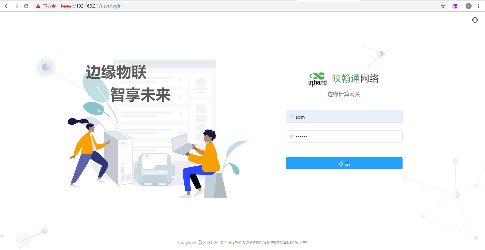  
 &nbsp;

- 步骤3：登录成功后，您可以看到如下图所示的网页。
  
 &nbsp;

- 步骤4：如需修改WEB管理界面的用户名和密码可进入IG902的“系统管理>>用户管理”页面设置新的用户名和密码。
 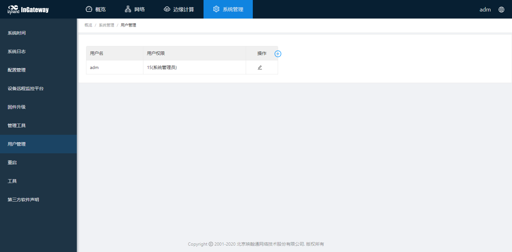  
 &nbsp;

- 步骤5：如需修改GE 0/2口的IP地址可访问IG902的“网络>>网络接口>>以太网>>千兆以太网0/2”页面进行修改。
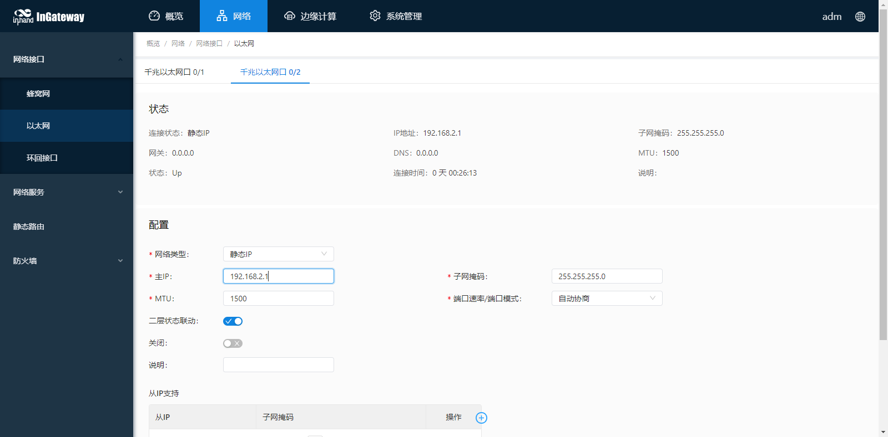  

### 1.2 设置WAN网络参数：连接Internet
  - 方法一：使用SIM卡拨号连接Internet
    - 步骤1：将SIM卡插入卡槽（注意：插拔SIM卡操作时，必须拔掉电源，以免造成数据丢失或设备损坏）。插入SIM卡后将4G LTE天线与ANT口连接，接通IG902的电源。    

      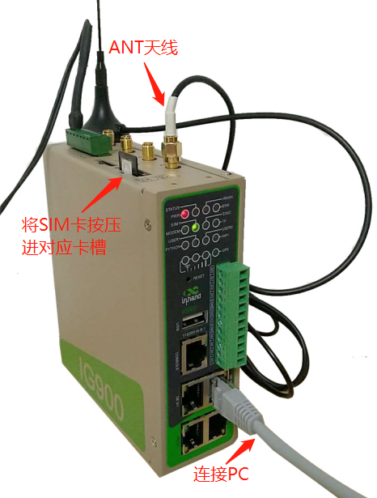   
 &nbsp;

    - 步骤2：进入IG902的“网络>>网络接口>>蜂窝网”页面，勾选“启用蜂窝网”并点击提交。
     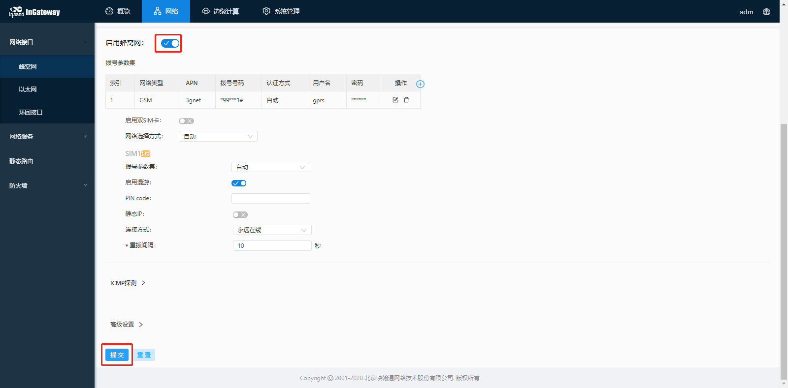
&nbsp;

      待网络连接状态显示为“连接”并且显示已分配相应IP地址等状态时说明IG902已通过SIM卡联网。
      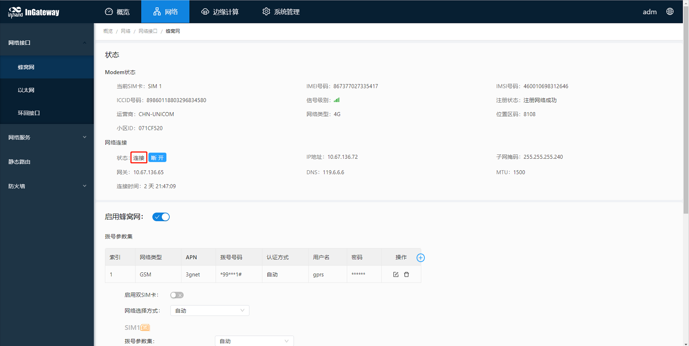
&nbsp;

  - 方法二：使用以太网连接Internet
    - 步骤1：使用以太网线连接IG902的GE 0/1和GE 0/2口，如下图：  

      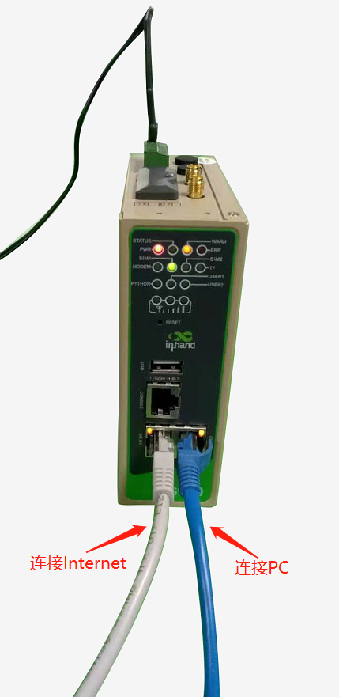   
   &nbsp;

    - 步骤2：进入IG902的“网络>>网络接口>>以太网>>千兆以太网0/1”页面，配置GE 0/1口的IP地址（网络类型为静态IP地址时需要根据现场网络情况配置IP、子网掩码等信息）并点击提交。
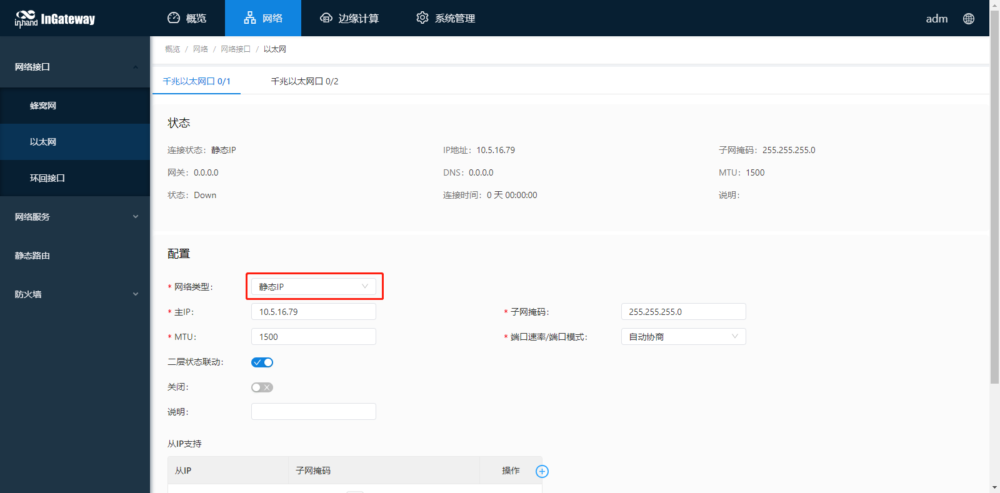  

         
   &nbsp;

    - 步骤3：进入IG902的“网络>>静态路由>>配置”页面，为GE 0/1口添加静态路由（接口项选择“Gigabitethernet 0/1”，其余项根据现场网络情况配置）并点击提交。
    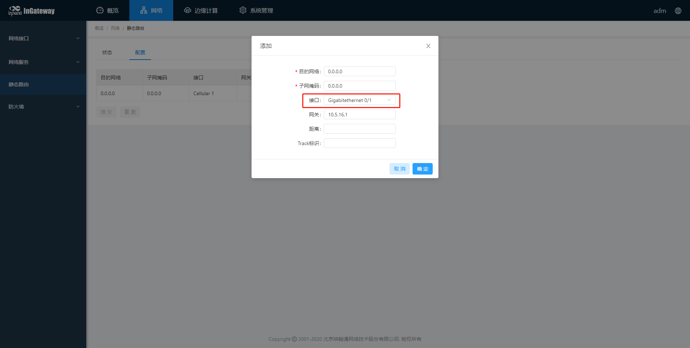   
   &nbsp;
    - 步骤4：进入IG902的“系统管理>>工具”页面，使用Ping命令检测IG902是否成功接入Internet。
  

## 2. 更新软件版本
如需获取IG902产品最新软件版本及其功能特性信息，请联系客服。如需更新IG902的软件版本，请参考如下方法：
- 更新IG902固件版本   
  点击“系统管理>>固件升级”，选择相应的固件文件后点击“开始升级”。IG902升级完成后，会提示重启设备以应用新的固件。
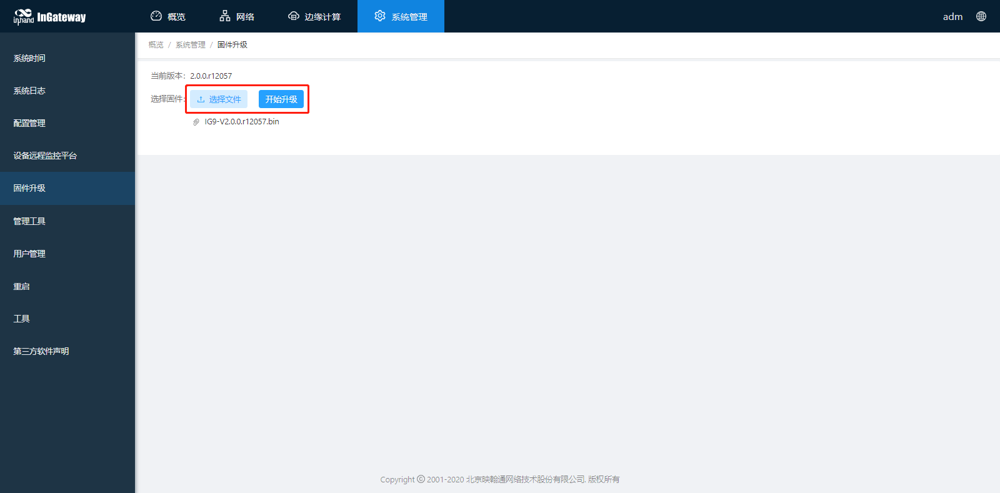   
&nbsp;
   
- 更新IG902 Python SDK版本   
进入“边缘计算>>Python边缘计算”页面，勾选“Python边缘计算引擎”并选择相应的Python SDK文件点击“升级”;弹出升级确认窗口时点击“确认”，IG902会自动完成升级操作。
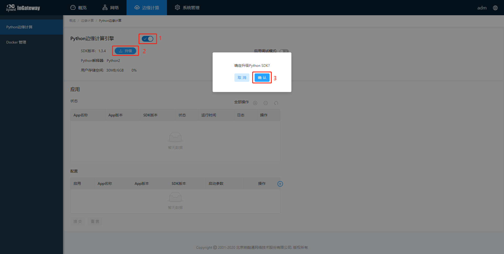   
&nbsp;
   
- 更新IG902 Docker SDK版本   
进入“边缘计算>>Docker管理”页面，点击升级并选择相应的Docker SDK文件
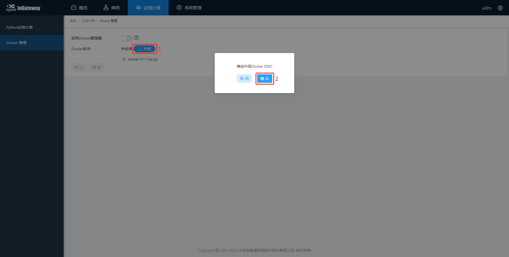   
&nbsp;
   
  安装成功后，勾选启用Docker管理器并点击“提交”。
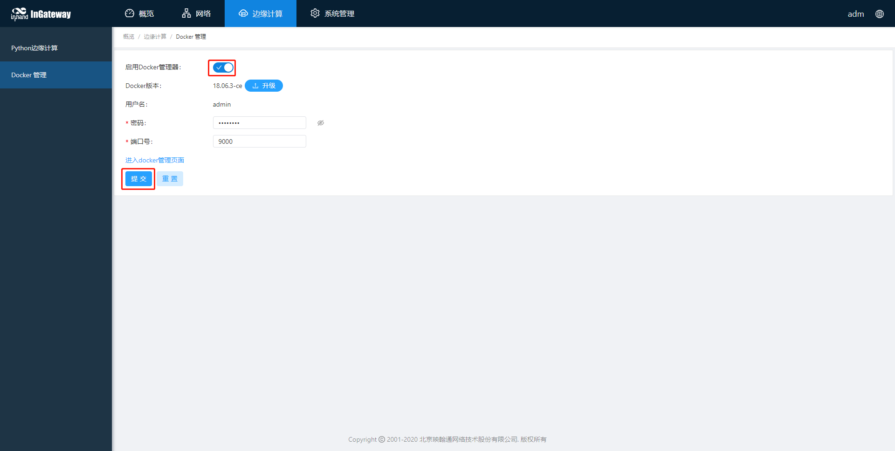   
   
  启用Docker管理器后，可以点击Docker管理器的访问按钮访问管理页面。
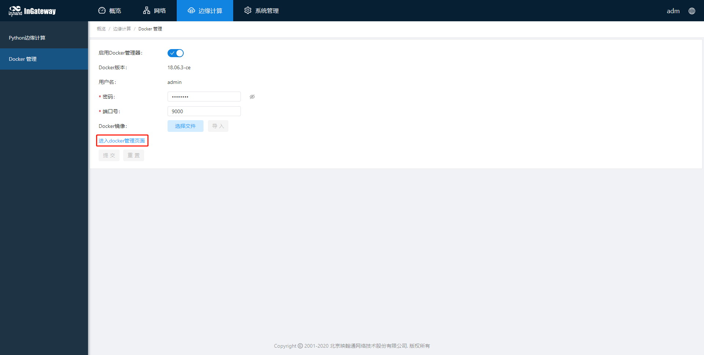
  
  输入上图中设置的账号密码即可登录Docker管理器。

## 3. 使用Pyhon边缘计算
### 3.1 安装和运行Python App
在IG902中安装和运行Python App（以下简称App）请参考如下流程：
- 步骤1：安装App   
  安装App前需要确保Python边缘计算引擎已启用且已安装Python SDK，如下图所示：
  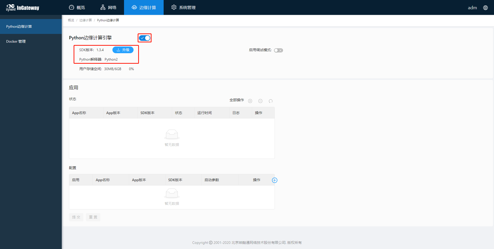   

  进入“边缘计算>>Python边缘计算”页面，点击添加按钮并选择需要安装的App包文件，随后点击确定。
  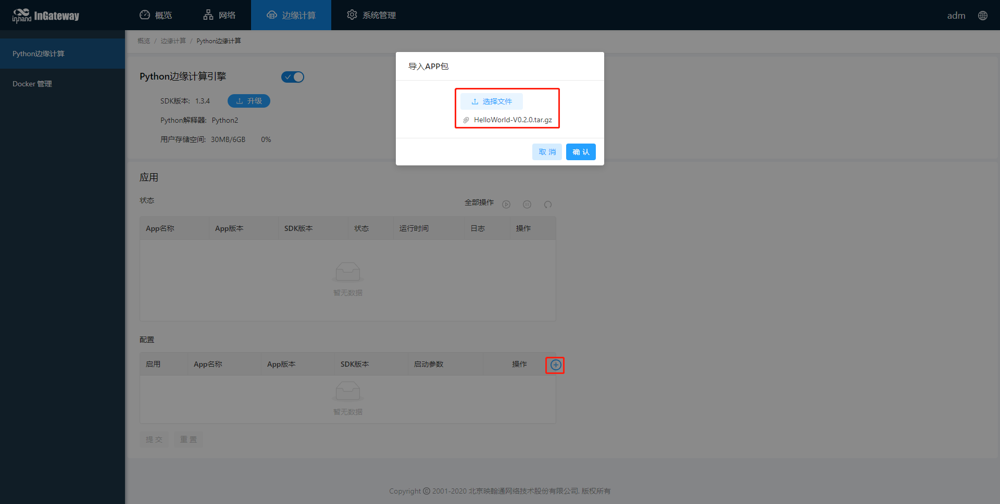   

  导入成功后可以查看已导入的App，如下图所示：
  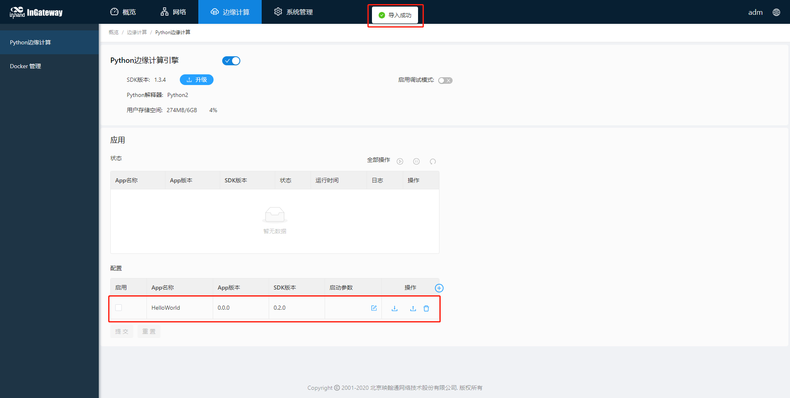   
&nbsp;
   
- 步骤2：运行App   
  勾选启用App并点击提交。
  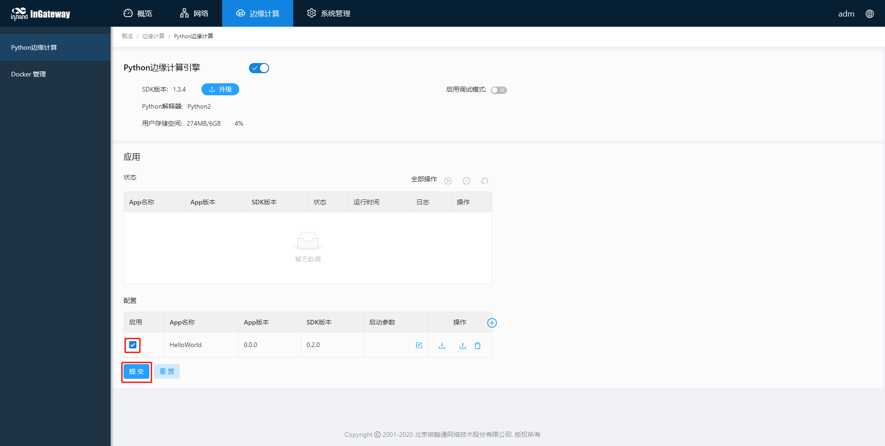   

  启用后App将在IG902中运行并且每次开机后自动运行。
  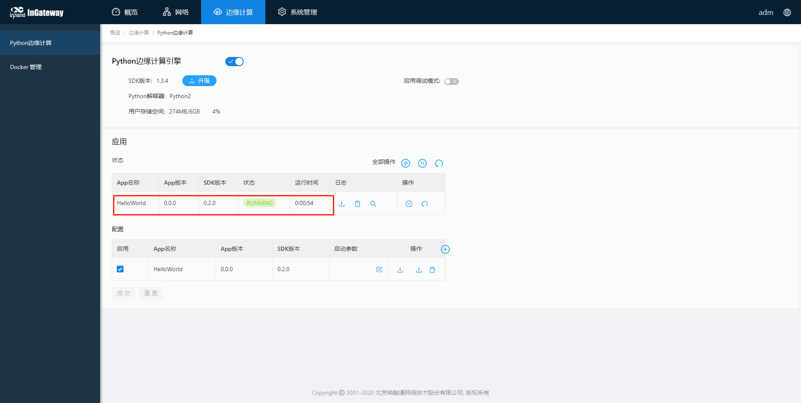

### 3.2 更新Python App运行配置
如果已安装的App支持导入配置文件修改运行方式，可参照如下流程更新App运行配置：
- 步骤1：进入“边缘计算>>Python边缘计算”页面，点击导入配置按钮并选择需要导入的配置文件，随后点击确认。
  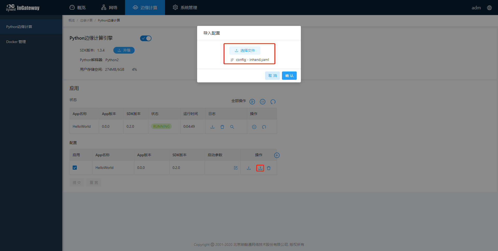   
&nbsp;
   
- 步骤2：导入成功后重启App，App重启完成后将按照导入后的配置文件运行。
  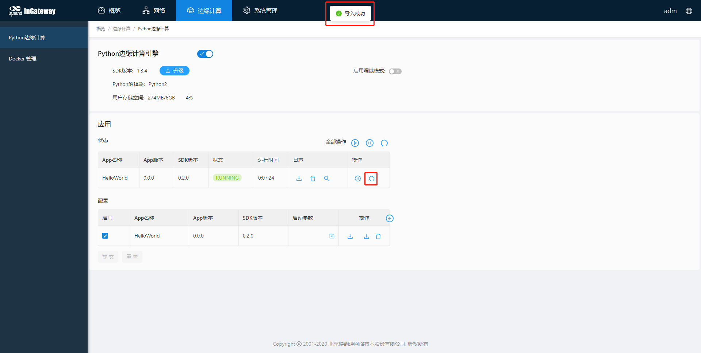

### 3.3 更新Python App版本
通常如需更新Python App版本时只需要在“边缘计算>>Python边缘计算”页面导入新版本的App即可  
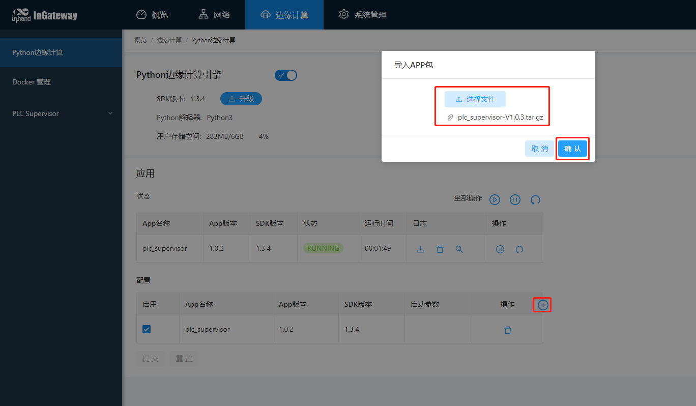  

更新完成后如下图所示  

### 3.4 开启调试模式
如需在IG902上运行并调试Python代码，需要启用IG902的调试模式。在“边缘计算>>Python边缘计算”页面中，勾选“启用调试模式”，启用后可通过VS Code对IG902进行开发。如何使用VS Code对IG902进行Python开发请参考[Python开发快速入门](https://ingateway-development-docs.readthedocs.io/zh_CN/latest/QuickStart.html)。
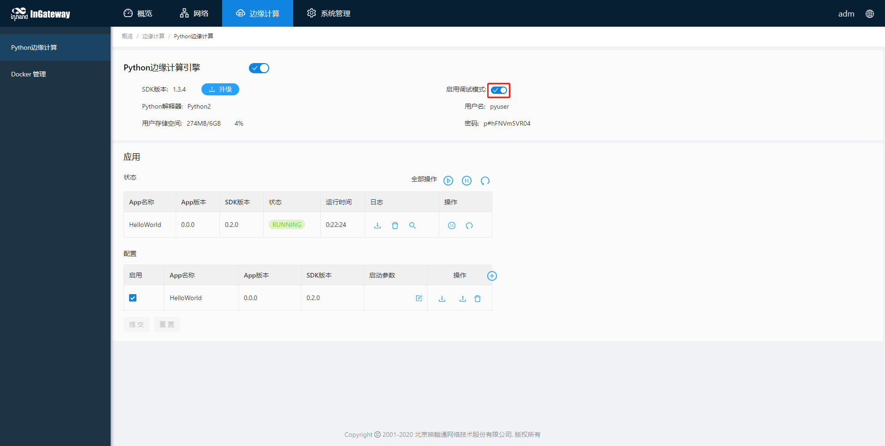  

启用调试模式后，IG902启动一个SSH Server，监听LAN网络(默认IP地址192.168.2.1)的222端口。SSH Server的用户名和密码将被显示到上述网页中。为了提高安全性，每次开启调试模式或重启设备，都会重新随机生成新的密码。

## 4. 设备远程监控平台
映翰通开发的设备远程监控平台支持监视IG902状态、远程维护设备、远程批量下发IG902配置和IG902批量升级等功能，帮助用户便捷、高效的管理IG902和现场设备。为了使设备远程监控平台能够远程管理IG902和现场设备，需要将IG902连接到云平台上，连接方法如下：  
进入“系统管理>>设备远程监控平台”页面，勾选启用设备远程监控平台并配置相应的服务器地址以及注册账户，配置完成后点击提交即可。
- 服务器地址：即设备远程监控平台地址。映翰通开发的远程监控平台地址如下：
  - 国内版Device Manager：`c.inhandcloud.com`  
  - 海外版Device Manager：`iot.inhandnetworks.com`  
  - 国内版InConnect：`ics.inhandiot.com`  
  - 海外版InConnect：`ics.inhandnetworks.com`  
- 注册账户：即IG902关联的设备远程监控平台账号（如果还未注册账户需要先注册一个账号）  
- 高级设置：包含心跳间隔等配置，一般使用默认配置即可

  

IG902与设备远程监控平台连接成功后状态描述为连接成功。  
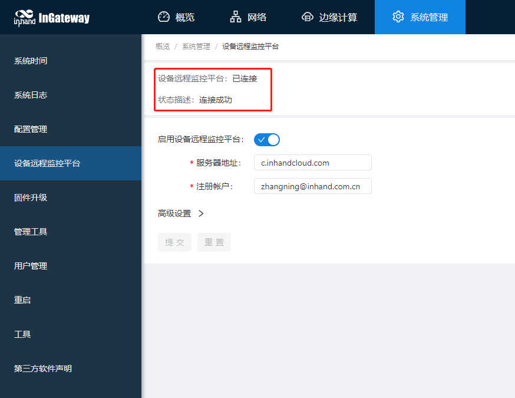  

## 5. 附录
### 5.1 恢复出厂设置
IG902恢复出厂设置的方式有两种：硬件恢复出厂设置和软件恢复出厂设置
- 硬件恢复出厂设置
  - 步骤1：设备上电且ERR灯熄灭后，按住RESET键；
  - 步骤2：ERR灯常亮时，松开RESET键；
  - 步骤3：ERR灯熄灭后，再次按住RESET键，ERR灯闪烁时松开RESET键；等待ERR灯熄灭，表明恢复出厂设置成功。   
&nbsp;
   
- 软件恢复出厂设置  
  进入“系统管理>>配置管理”页面，点击重置按钮并选择确定。IG902将自行完成恢复出厂设置操作。
  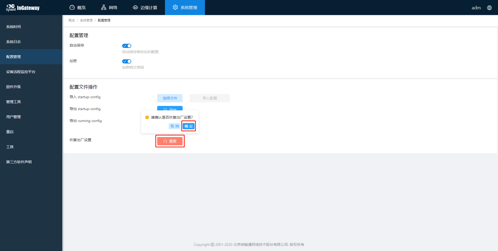